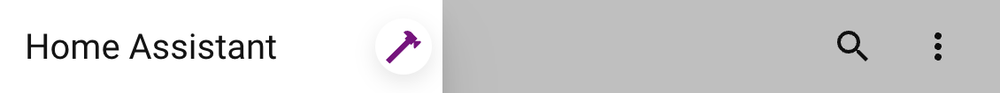

# Examples

!!! note
    UIX Broker is available in 8.2.0-beta.2

## Make the card tab the default in the UI add-card dialog

Outcome:

- Select the card tab when the add-card dialog opens.
- Make sure the first expander, Suggested or Favorites, is open.
- Collapse all other expanders.

Method:

- Listen to `show-dialog` in the `browser` realm.
- The matching rule passes only when the `show-dialog` event's `dialogTag` is `hui-dialog-create-card`.
- Use an absolute short-form interaction anchor that matches the dialog (`hui-dialog-create-card`).
- Directives:
  - Set the dialog's `_currTab` property to `card`. As this property is reactive, there is no need to force an update.
  - Set the first expander's `expanded` property to `true`, using a relative short-form anchor.
  - Set the other expanders' `expanded` property to `false`, using relative short-form anchors.

```yaml
uix_broker:
  - realm: browser
    listen: show-dialog
    anchor: '&home-assistant $ hui-dialog-create-card'
    debug: true
    rules:
      - '@captured.dialogTag': hui-dialog-create-card
    directives:
      - type: property
        set: _currTab
        value: card
        wait: 1000
      - type: property
        anchor: >-
          $ ha-dialog div.body hui-card-picker $ div#content div:nth-of-type(1)
          ha-expansion-panel
        set: expanded
        value: true
      - type: property
        anchor: >-
          $ ha-dialog div.body hui-card-picker $
          div#content>ha-expansion-panel:nth-of-type(1)
        set: expanded
        value: false
      - type: property
        anchor: >-
          $ ha-dialog div.body hui-card-picker $
          div#content>ha-expansion-panel:nth-of-type(2)
        set: expanded
        value: false
      - type: property
        anchor: >-
          $ ha-dialog div.body hui-card-picker $
          div#content>ha-expansion-panel:nth-of-type(3)
        set: expanded
        value: false
```

!!! tip
    Save the YAML as a new file in your Home Assistant configuration directory or subdirectory, then register it using the UIX options config flow.

## Automation sidebar and YAML mode

### Open the automation editor sidebar in YAML mode by default

Combine this with the following example to allow changing YAML mode; by itself, this example locks the automation sidebar to **always** use YAML mode.

Outcome:

- Set the automation sidebar to YAML mode.

Method:

- Listen to the `open-sidebar` event in the `browser` realm.
- Set `reentrant: false` to prevent re-entry when toggling YAML mode itself fires `open-sidebar`.
- The interaction anchor is `manual-automation-editor`, which is found through an outward search across the event's composed path and shadow-root boundaries.
- Use a short-form host-element path selection rule to continue only when `uixBlockAutoYamlMode` does **not** exist on the interaction anchor's JavaScript object. This is important when combined with the following example.
- Use a call directive to invoke `_toggleYamlMode()` on `ha-automation-sidebar`, resolved by searching the first shadow root of the interaction anchor, `manual-automation-editor`.

```yaml
  - realm: browser
    listen: open-sidebar
    reentrant: false
    anchor: manual-automation-editor <$$ target
    rules:
      - '{!.uixBlockAutoYamlMode}'
      - anchor: $ ha-automation-sidebar $$ ha-automation-sidebar-card
        match: '{.yamlMode=false}'
    directives:
      - anchor: $ ha-automation-sidebar
        method: _toggleYamlMode
        type: call
```

### Allow toggle YAML mode in automation editor

Use this example with the previous one and the next example (a keyboard shortcut to toggle YAML mode).

The Toggle YAML Mode menu item in the automation editor runs code that fires `toggle-yaml-mode`, which ultimately calls `_toggleYamlMode()` on `manual-automation-editor`. Without coordination, this would always force YAML mode. This example works around that by blocking the event, setting a guard property, calling the function directly, then clearing the guard.

Outcome:

- Allow the Toggle YAML Mode menu item to switch between the visual editor and YAML mode.

Method:

- Listen to `toggle-yaml-mode` in the `browser` realm.
- The interaction anchor is `manual-automation-editor`, which is found through an outward search across the event's composed path and shadow-root boundaries.
- Directives:
  - Block the event because it will be handled directly.
  - Set `uixBlockAutoYamlMode` to `true` on `manual-automation-editor`.
  - Use a call directive to invoke `_toggleYamlMode()` on `ha-automation-sidebar`, resolved by searching the first shadow root of the interaction anchor, `manual-automation-editor`. As the previous example checks for the absence of `uixBlockAutoYamlMode`, it does not proceed with its directive to force YAML mode.
  - Clear `uixBlockAutoYamlMode` so the previous example once again forces YAML mode when the sidebar opens.

```yaml
  - realm: browser
    listen: toggle-yaml-mode
    anchor: manual-automation-editor <$$ target
    directives:
      - type: block
      - type: property
        set: uixBlockAutoYamlMode
        value: true
      - anchor: $ ha-automation-sidebar
        method: _toggleYamlMode
        type: call
      - type: property
        clear: uixBlockAutoYamlMode
```

### Toggle YAML mode in automation editor with keyboard shortcut

Outcome:

- Use a keyboard shortcut to toggle YAML mode in the automation editor.

Method:

- Listen for a keyboard shortcut in the `shortcut` realm (`$mod+Shift+Y` in the code below; change it to suit).
- Use the absolute interaction anchor `&home-assistant $$ manual-automation-editor` because the keyboard shortcut target can be any DOM element.
- Directives:
  - Set `uixBlockAutoYamlMode` to `true` on `manual-automation-editor`.
  - Use a call directive to invoke `_toggleYamlMode()` on `ha-automation-sidebar`, resolved by searching the first shadow root of the interaction anchor, `manual-automation-editor`. As the automatic YAML-mode example checks for the absence of `uixBlockAutoYamlMode`, it does not proceed with its directive to force YAML mode.
  - Clear `uixBlockAutoYamlMode` so the automatic YAML-mode example once again forces YAML mode when the sidebar opens.

```yaml
  - realm: shortcut
    enabled: true
    listen: $mod+Shift+Y
    anchor: '&home-assistant $$ manual-automation-editor'
    directives:
      - type: property
        set: uixBlockAutoYamlMode
        value: true
      - anchor: $ ha-automation-sidebar
        method: _toggleYamlMode
        type: call
      - type: property
        clear: uixBlockAutoYamlMode
```

## Automation sidebar and YAML mode complete

??? example "Complete YAML for the three automation sidebar examples"
    Save the YAML as a new file in your Home Assistant configuration directory or subdirectory, then register it using the UIX options config flow.
    ```yaml
    uix_broker:
      - realm: browser
        listen: open-sidebar
        reentrant: false
        anchor: manual-automation-editor <$$ target
        rules:
          - '{!.uixBlockAutoYamlMode}'
          - anchor: $ ha-automation-sidebar $$ ha-automation-sidebar-card
            match: '{.yamlMode=false}'
        directives:
          - anchor: $ ha-automation-sidebar
            method: _toggleYamlMode
            type: call
      - realm: browser
        listen: toggle-yaml-mode
        anchor: manual-automation-editor <$$ target
        directives:
          - type: block
          - type: property
            set: uixBlockAutoYamlMode
            value: true
          - anchor: $ ha-automation-sidebar
            method: _toggleYamlMode
            type: call
          - type: property
            clear: uixBlockAutoYamlMode
      - realm: shortcut
        enabled: true
        listen: $mod+Shift+Y
        anchor: '&home-assistant $$ manual-automation-editor'
        directives:
          - type: property
            set: uixBlockAutoYamlMode
            value: true
          - anchor: $ ha-automation-sidebar
            method: _toggleYamlMode
            type: call
          - type: property
            clear: uixBlockAutoYamlMode
    ```

## Prioritize entity triggers when adding an automation editor element

Outcome:

- Jump straight to entity triggers when adding an automation editor element.

Method:

- Listen for the `show-dialog` event in the `browser` realm.
- The matching rule passes only when the `show-dialog` event's `dialogTag` is `add-automation-element-dialog`.
- Use an absolute short-form interaction anchor that matches the dialog (`add-automation-element-dialog`).
- Directives:
  - Set the `_tab` property to `groups`; `groups` is the value for By Type.
  - Set `_selectedGroup` to `entity` to focus on the generic entity triggers.

```yaml
  - realm: browser
    listen: show-dialog
    anchor: '&home-assistant $ add-automation-element-dialog'
    debug: true
    rules:
      - '@captured.dialogTag': add-automation-element-dialog
    directives:
      - type: property
        set: _tab
        value: groups
      - type: property
        set: _selectedGroup
        value: entity
```

## Add tools button to sidebar title

Outcome: A tools button that navigates to /config/tools.

Method:

- Listen for the `hass-toggle-menu` event in the `browser` realm.
- Uses compact absolute anchor for `ha-sidebar`
- The matching rule only passes when `user.is_admin` property of the `hass` object on `home-assistant` is true (this could also be `user.is_owner` to match only the owner user).
- Uses `button` directive to place button after the title using simple style object to give a box-shadow and reduced icon size.

```yaml
  - realm: browser
    listen: hass-toggle-menu
    anchor: "&home-assistant $ home-assistant-main $ ha-sidebar"
    debug: true
    rules:
      - anchor: "&home-assistant"
        match: "{.hass.user.is_admin=true}"
    directives:
      - type: button
        anchor: "$ div.menu div.title"
        icon: mdi:hammer
        color: purple
        size: s
        tap_action:
          action: navigate
          navigation_path: /config/tools
        style:
          "--ha-button-box-shadow": rgba(0, 0, 0, 0.1) 0px 4px 12px
          "--ha-icon-button-size": 32px
```

{ width="450" }
