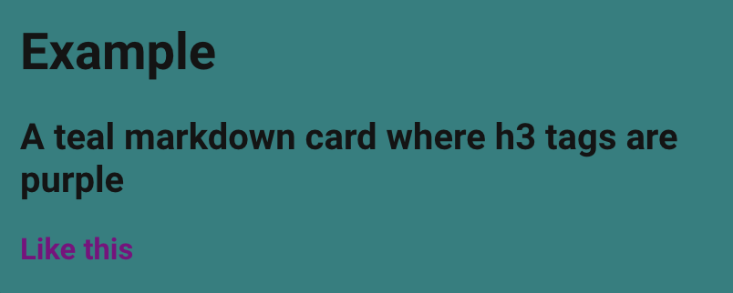

# DOM navigation

Home Assistant makes extensive use of concept called [shadow DOM](https://developer.mozilla.org/en-US/docs/Web/Web_Components/Using_shadow_DOM). This allows for easy reuse of components (such as `<ha-card>` or `<ha-icon>`) but requires some advanced techniques when applying CSS styles to elements.

When exploring cards in your browsers element inspector, you may have come across a line that says something like `#shadow-root (open)` (exactly what it says depends on your browser) and have noticed that elements inside that does not inherit the styles from outside.

In order to style elements inside a `#shadow-root`, you will need to make your `style:` a dictionary rather than a string.

For each dictionary entry the key will be used to select one or several elements through a modified [`querySelector()`](https://developer.mozilla.org/en-US/docs/Web/API/Document/querySelector) function. The value of the entry will then be injected into those elements.

!!! tip
    The modified `querySelector()` function will replace a dollar sign `$` with a `#shadow-root` in the selector.

The process is recursive, so the value may also be a dictionary. A key of `.` (a period) will select the current element.

??? example
    Let's change the color of all third level titles `### like this` in a markdown card, and also change the card's background.
    ```yaml
    type: markdown
    content: |-
        # Example
        ## A teal markdown card where h3 tags are purple
        ### Like this
    ```

    In the element inspector of chrome, the HTML will be similar to the image below.

    {: width="400" }
    {: width="400" }

    The `<ha-card>` element is the base, and from there we see that we need to go through one `#shadow-root` to reach the `<h3>`. That `#shadow-root` is inside an `<ha-markdown>` element, so our selector will be:
    ```yaml
      ha-markdown $:
    ```
    which will find the first `<ha-markdown>` element and then all `#shadow-root`s inside that.

    To add the background to the `<ha-card>`, we want to apply the styles to the base element directly, which has the key

    ```yaml
      .:
    ```

    This gives the final style:

    ```yaml
    uix:
      style:
        ha-markdown$: |
          h3 {
            color: purple;
          }
        .: |
          ha-card {
            background: teal;
          }
    ```

    {: width="400"}

The selector chain of the queue will look for one element at a time separated by spaces or `$`. For each step, only the first match will be selected. But for the final selector of the chain (i.e. in a given dictionary key) **all** matching elements will be selected.

Chains ending with `$` is a special case for convenience, selecting the shadow roots of all elements.

!!! example "Chaining example"
    The following will select the `div` elements in the first marker on a map card:
    ```yaml
      ha-map $ ha-entity-marker $ div: |
    ```
    But the following will select the div elements in all map markers on a map card (because we end the first key on the `ha-entity-marker $` selector and start a new search within each result for `div`):
    ```yaml
      ha-map $ ha-entity-marker $:
        div: |
    ```

!!! warning "Load order optimization"
    Following on the note above, due to the high level of load order optimization used in Home Assistant, it is not guaranteed that the `ha-entity-marker` elements exist at the time when UIX is looking for them.

    If you break the chain once more:
    ```yaml
      ha-map $:
        ha-entity-marker $:
          div: |
    ```
    then UIX will be able to retry looking from the `ha-map $` point at a later time, which may lead to more stable results.

    In short, if things seem to be working intermittently, then try splitting up the chain into several steps.

## DOM inspection helpers

UIX ships two browser console helpers that make it easier to discover valid style paths and understand the UIX element hierarchy at runtime. Open your browser's DevTools console, select an element in the **Elements** panel (it becomes `$0`), then call one of the functions below.

### `uix_tree($0)` — general helper

Reports everything UIX knows about the area surrounding the selected element:

| Section | What it shows |
| ------- | ------------- |
| **📦 Closest UIX Parent** | The nearest ancestor element that has a non-child `uix-node` attached, with UIX template variables (usually `config`) and its UIX type (e.g. `card`, `view`). |
| **👶 Active UIX Children** | Paths that are currently being styled as children of the UIX parent, with the resolved DOM elements shown. |
| **🗺️ Available YAML Selectors** | Every YAML style key reachable within the UIX parent's shadow DOM subtree (stopping at the next UIX parent boundary). Each key maps to one shadow context; inside you'll find the CSS selectors valid for that key's style string. |

```js
uix_tree($0)
```

??? example
    After selecting a card element in the inspector and running `uix_tree($0)`, the console output might look like:

    ```
    💡 UIX Tree 💡
      Target element: <hui-card>
      📦 Closest UIX Parent
        Element: <hui-card>
        UIX type: card
      👶 Active UIX Children: none
      🗺️ Available YAML Selectors  (2 YAML selectors, 5 CSS selectors)
        ".":  (2 CSS selectors)
          ha-card  <ha-card>
          ha-card ha-markdown  <ha-markdown>
        "ha-markdown $":  (3 CSS selectors)
          h3  <h3>
          p  <p>
          p span  <span>
    ```

    Each group label shows a YAML style key followed by the required `:` syntax. The CSS selectors inside are valid within that key's style string. Each selector is followed by a clickable element reference — click it to jump straight to that element in the DevTools inspector.

### `uix_path($0)` — specific helper

Reports the exact UIX path to the selected element and generates a ready-to-paste YAML snippet:

| Section | What it shows |
| ------- | ------------- |
| **📦 Closest UIX Parent** | Same as `uix_tree`. |
| **📍 UIX Path to Target** | The exact path string (using `$` for shadow-root crossings) from the UIX parent context to `$0`. Use this as the key in a UIX `style:` config. |
| **🎨 CSS Target** | Tag name, id, classes and a suggested CSS selector for the element — each followed by a clickable element reference to jump straight to it in the DevTools inspector. |
| **📝 Boilerplate UIX YAML** | A paste-ready card-level YAML snippet to get you started. Shown only for types that can be styled via a card-level `uix:` key. |
| **📝 Boilerplate Theme YAML** | A paste-ready theme YAML snippet. Shown for all types — for theme-only types (e.g. `dialog`, `sidebar`, `view`) this is the only boilerplate shown. When shadow-root crossings are needed, the `-yaml` variant of the theme variable is used.

To use `uix_path($0)`, open your browser's DevTools console, select an element in the **Elements** panel (it becomes `$0`), and run the function:

```js
uix_path($0)
```

??? example "Card element (shows both card and theme boilerplate)"
    After selecting the `<h3>` heading inside a markdown card and running `uix_path($0)`:

    ```
    💡 UIX Path 💡
      Target element: <h3>
      📦 Closest UIX Parent
        Element: <hui-markdown-card>
        UIX type: card
      📍 UIX Path to Target
        Path: "ha-markdown $":
      🎨 CSS Target
        Tag: h3
        Suggested CSS selector: h3  <h3>
      📝 Boilerplate UIX YAML
        uix:
          style:
            "ha-markdown $": |
              h3 {
                /* your styles for h3 */
              }
      📝 Boilerplate Theme YAML
        my-awesome-theme:
          uix-theme: my-awesome-theme
          uix-card-yaml: |
            "ha-markdown $": |
              h3 {
                /* your styles for h3 */
              }
    ```

    The **Path** line shows the YAML key including the required `:`. The **Suggested CSS selector** is followed by a clickable element reference that jumps to the element in DevTools.

??? example "Dialog element (shows theme boilerplate only)"
    After selecting an element inside a dialog and running `uix_path($0)`:

    ```
    💡 UIX Path 💡
      Target element: <ha-dialog-header>
      📦 Closest UIX Parent
        Element: <ha-more-info-dialog>
        UIX type: dialog
      📍 UIX Path to Target
        Path: "$":
      🎨 CSS Target
        Tag: ha-dialog-header
        Suggested CSS selector: ha-dialog-header  <ha-dialog-header>
      📝 Boilerplate Theme YAML
        my-awesome-theme:
          uix-theme: my-awesome-theme
          uix-dialog-yaml: |
            "$": |
              ha-dialog-header {
                /* your styles for ha-dialog-header */
              }
    ```

    Theme-only types (`dialog`, `root`, `view`, `more-info`, `sidebar`, `config`, `panel-custom`, `top-app-bar-fixed`, `developer-tools`) only show theme boilerplate because they cannot be styled via a card-level `uix:` key. When shadow-root crossings appear in the path, the `-yaml` variant of the theme variable is used.
