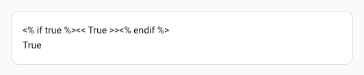
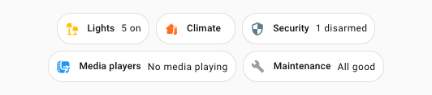
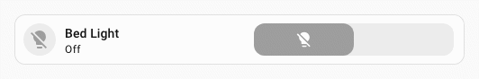
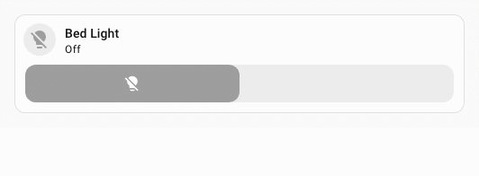
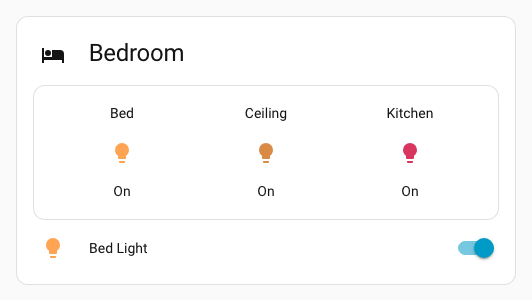
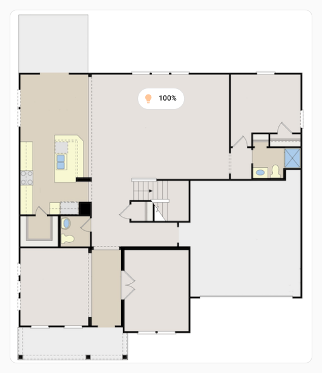

# UIX Forge

UIX Forge (`custom:uix-forge`) is a custom Lovelace element that combines template-driven configuration with additional behaviours called **sparks**. Use it to:

- **Forge** any standard Home Assistant element from templates, allowing the entire element config to react to entity states, user, browser and other template variables.
- **Add sparks** — self-contained behaviours that augment the forged element.
- **Apply UIX styles** to the forged element, exactly like any other element. Additionally any spark variables are made available in the `uixForge` template variable.

!!! tip "Wrap in UIX Forge"
    Look for the :bulb: icon in YAML code editors for card, badge, row, picture-element, card-feature to easily wrap the existing elements's code in UIX Forge to quickly get started form a base element.

## Basic structure

```yaml
type: custom:uix-forge
forge:
  mold: card
  # optional sparks, macros, hidden, grid_options …
element:
  type: tile
  entity: "{{ 'sun.sun' }}"
  # any valid element config, templates supported
```

`forge` controls how UIX Forge itself behaves; `element` is the configuration of the Home Assistant element that will be rendered inside it.

## Forge options

| Key | Type | Allows Templates | Default | Description |
| --- | ---- | ---------------- | ------- | ----------- |
| `mold` | string | | (required) | How the element is forged, with each `mold` handling required forged element behaviours within Home Assistant Frontend. Standard molds: `"card"`, `"badge"`, `"row"`, `"picture-element"`, `"section"`, `"footer"`, `"card-feature"`. Cross-context molds: `"card_as_row"`, `"card_as_badge"`, `"row_as_card"`, `"row_as_badge"`, `"badge_as_card"`, `"badge_as_row"`, `"badge_as_picture_element"`. See [Cross-context molds](#cross-context-molds). |
| `macros` | mapping | | — | [template macros](../using/templates.md#macros) available to all templates in the forge config. Macros are also passed to `uix` config in both forge and forged element. See [UIX Styling - variables and macros](#variables-and-macros) |
| `billets` | mapping | | — | [billets](#billets) — named YAML values available as template constants in all templates in the forge config. See [Billets](#billets) |
| `hidden` | boolean | ✅ | `false` | When truthy the element is hidden. |
| `grid_options` | mapping | ✅ | — | Lovelace grid options (e.g. `rows`, `columns`) for when `mold` is `card`. Ignored for any other `mold`. |
| `show_error` | boolean | | `false` | When `true`, show the Lovelace error card instead of hiding it when the forged element errors. |
| `template_nesting` | string | | `"<<>>"` | Four-character string used to escape nested templates. A single setting controls both Jinja forms: with the default `<<>>`, use `<<...>>` for `{{...}}` and `<%...%>` for `` in the same nested template. Use when the element config itself contains Jinja2-like syntax. When nesting multiple forge layers deep, add an extra `<>` pair per additional layer (e.g. `<<< >>>` and `<<% %>>` for two layers of nesting). |
| `sparks` | list | ✅ | `[]` | List of [spark](#sparks) configurations to attach to the forged element. |
| `delayed_hass` | boolean | | - | Flag to delay the passing of hass object to the card until after it is loaded. Used to suppress console errors or other issues for some custom cards. e.g. apexcharts_card. |

## Element config

Any valid Lovelace element configuration. Every string value in `element` is processed as a template, giving access to the same variables as [UIX templates](../using/templates.md) (`config`, `user`, `browser`, `hash`, `panel`).

The `uix` key inside `element` is passed through as is to [UIX Styling](../using/index.md), with [UIX Styling](../using/index.md) rendering any templates. Use it to style the forged element as you would any other element:

!!! example inline end "Forge example"
    

```yaml
type: custom:uix-forge
forge:
  mold: card
element:
  type: tile
  entity: light.bed_light
  uix:
    style: |
      ha-card {
        --tile-color: teal !important;
      }
```

### Template variables and macros

Macros from the forge are passed through to UIX Styling for both the forge and the forged element, making forge macros available to use in UIX Styling for both forge and forged element.

Templates will run in different contexts for forging, UIX styling the forge and UIX styling the element. The table below summarizes the different contexts.

| Context | Template variables |
| - | - |
| Templates in forge and element, except `uix` styling | **forge config**: `config.forge`<br/> **element config**: `config.element`<br/>`config.entity` is available if included in global `uix-forge` config. |
| Templates in forge `uix` styling | **forge config**: `config.forge`<br/>**element config**: `config.element`<br/>`config.entity` is available if included in global `uix-forge` config. |
| Templates in element `uix` styling. Here the template is run in regular `uix` styling context for the forged element | **forge config**: unavailable<br/>**element config**: `config`<br/>`config.entity` is available if included in global `uix-forge` config. |

!!! tip
    If you specify `entity` on global `uix-forge` config it will always be available no matter the context. You always need to specifically specify the element entity if it needs one - you can use a template to use `config.entity`.
    ```yaml
    type: custom:uix-forge
    entity: light.bed_light
    forge:
      mold: card
    element:
      type: tile
      entity: "{{ config.entity }}"
      uix:
        style: |
          :host {
            --ha-card-border-color: {{ 'green' if is_state(config.entity, 'on') else 'red' }};
            --ha-card-border-width: 2px;
          }
    ```

    

#### Full example including macro

!!! example inline end "Full example including macro"
    

```yaml
type: custom:uix-forge
entity: light.bed_light
forge:
  mold: card
  macros:
    state_color:
      params:
        - entity_id
      template: "{{ 'red' if is_state(entity_id, 'on') else 'green' }}"
  uix:
    style: |
      :host {
        --ha-card-border-radius: 20px;
        --ha-card-border-color: {{ state_color(config.entity) }};
        --ha-card-border-width: 3px;
      }
element:
  type: tile
  entity: "{{ config.entity }}"
  name: "{{ device_name(config.entity) }} - {{ state_translated(config.entity) }}"
  uix:
    style: |
      span.primary {
        color: {{ state_color(config.entity) }};
      }
```

### Billets

Billets are named YAML values defined under `forge.billets`. They are available as template constants in all forge templates **and** in any `uix:` style on the forge card or the forged element, and can be used **without parentheses**, unlike macros. Billet string values may reference other billets via `{name}` substitution — see [Billet interpolation](#billet-interpolation) below. Billets cannot contain Jinja2 templates themselves, except inside nested `uix` objects where the template is rendered by UIX Styling and not UIX Forge.

```yaml
type: custom:uix-forge
entity: light.bed_light
forge:
  mold: card
  grid_options:
    columns: 7
  billets:
    my_color: teal
    max_brightness: 255
    tags:
      - living_room
      - ambient
element:
  type: tile
  entity: "{{ config.entity }}"
  name: "{{ my_color | capitalize }} light"
  tap_action:
    action: perform-action
    perform_action: light.turn_on
    target:
      entity_id: "{{ config.entity }}"
    data:
      brightness: "{{ max_brightness }}"
  uix:
    style: |
      ha-card {
        --tile-color: {{ my_color }} !important;
      }
      ha-tile-info span:nth-of-type(2):after {
      
        content: ' - {{ tags | join(', ') }} - MAX';
        font-weight: 900;
      
        content: ' - {{ tags | join(', ') }}';
      
      }
```


#### Billet types

The YAML type of a billet determines how it is represented in templates:

| YAML type | Example | Jinja2 type | Template usage |
| --------- | ------- | ----------- | -------------- |
| Empty (`~` or `null`) | `my_billet: ~` | `none` | `{{ my_billet }}` → empty |
| String | `my_billet: hello` | `str` | `{{ my_billet }}` → `hello` |
| Number | `my_billet: 42` | `int` or `float` | `{{ my_billet + 1 }}` → `43` |
| Boolean | `my_billet: true` | `bool` | `…` |
| List | `my_billet: [1, 2, 3]` | `list` | `{{ my_billet | join(', ') }}` |
| Mapping | `my_billet: {a: 1}` | `dict` | `{{ my_billet.a }}` |

Each billet is injected as a `` statement, preserving the native Jinja2 type for all YAML types — no macro wrapper is needed.

#### Billet interpolation

String billet values may reference other billets using `{name}` syntax — a simple substitution performed before the billets are turned into Jinja2 variables. Use `{name[N]}` to reference element `N` (0-indexed) from a list billet:

```yaml
forge:
  billets:
    room: "bed"                         # plain string
    entity_id: "light.{room}_light"     # → "light.bed_light"
    scenes:
      - bright
      - dim
    default_scene: "{scenes[0]}"        # → "bright"
```

Billet references are resolved in dependency order, so declaration order does not matter:

```yaml
billets:
  entity: "light.{room}_light" # → "light.bedroom_light"  (resolved after room)
  room: "{base}room"           # → "bedroom"  (resolved after base)
  base: "bed"
```

!!! note "Circular references"
    If billets reference each other in a cycle (directly or through a chain), none of the cycle members can be resolved. UIX logs an error for each and leaves their values unchanged.

#### Billets and foundries

Billets follow the same override behaviour as macros: a foundry can define billets, and local forge config can override individual billet entries. Only the billets whose names are referenced in a template are included in that template's preamble.

See [Billets in foundries](./foundries.md#billets-in-foundries) for patterns on defining empty billet slots in a foundry and handling the `none` case in templates.

### Template nesting

If the element you are forging uses Jinja style templates or same markers (e.g. ha-nunjucks) then you will need to nest these templates. The default nesting characters are `<<>>`. This can be adjusted in forge config if required. Jinja statement/flow-control delimiters (``) are inferred from the nesting character config. When default nesting characters `<<>>` are in use, use `<% %>` for single nesting of Jinja statements/flow-control syntax.

??? example "Single level template nesting example"
    Below is an example using `custom:template-entity-row` which itself supports templates. This requires any template that needs to be rendered by `custom:template-entity-row` to be nested in `<<>>` nesting characters.
    ```yaml
    type: custom:uix-forge
    entity: input_boolean.test_boolean
    forge:
      mold: card
    element:
      type: entities
      entities:
        - type: custom:template-entity-row
          entity: "{{ config.entity }}"
          state: |
            <<states(config.entity,with_unit=True)>>
    ```
    The rendered config for the `entities` card is below. You will see that the nested template gets rendered to a final template with `{#uix#}` template comments surrounding the template. This template will then be rendered in `custom:template-entity-row`, with `config.entity` being a reference to the rendered config entity, which is `input_boolean.test_boolean`.
    ```yaml
    type: entities
    entities:
      - type: 'custom:template-entity-row'
        entity: input_boolean.test_boolean
        state: '{#uix#}{{states(config.entity,with_unit=True)}}{#uix#}'
    ```

#### Multiple nesting levels

When there are multiple forge layers, each additional layer requires one extra `<` / `>` pair (e.g. `<<<` / `>>>` and `<<% %>>` for two levels). UIX strips one nesting level internally at each intermediate forge layer, so the correct number of delimiters reaches the final forge layer automatically — you only need to set `template_nesting` to the total number of layers deep the value needs to travel.

??? example "Multiple nesting levels example with output"
    ```yaml
    type: custom:uix-forge
    entity: media_player.kitchen # overall entity in global uix-forge config
    forge:
      mold: card
      sparks:
        - type: grid
          for: "hui-grid-card $ #root"
          columns: 40% auto
          column_gap: 0px
    element:
      type: grid
      square: false
      cards:
        - type: custom:uix-forge
          entity: "{{ config.entity }}" # use config.entity directly for nested forge
          forge:
            mold: card
          element:
            entity: "{{ config.entity }}" # use config.entity directly for nested forge element
            type: tile
            state_content: is_volume_muted
        - type: custom:uix-forge
          entity: "{{ config.entity }}" # use config.entity directly for nested forge
          forge:
            mold: card
          element:
            type: custom:custom-features-card
            features:
              - type: custom:service-call
                entries:
                  - type: button
                    entity_id: << config.entity >> # use first level nesting
                    icon: mdi:volume-high
                    haptics: true
                    tap_action:
                      action: perform-action
                      perform_action: media_player.volume_mute
                      target:
                        entity_id: |
                          <<< config.entity >>> {# use second level nesting #}
                      data:
                        is_volume_muted: true
    ```

    

??? example "Multiple nesting levels with markdown card"
    This example shows that the markdown output will render the first level nested template and just output the second level nested template, showing exactly how nesting works.

    ```yaml
    type: custom:uix-forge
    forge:
      mold: card
    element:
      type: markdown
      content: |
        <<% if true %>><<< True >>><<% endif %>>
        <% if true %><< True >><% endif %>
    ```

    

#### Template nesting and macros

Template nesting **is not** supported in macros. It is impossible to get a rendered template text from a macro. Macros are available to UIX Forge templates and UIX Styling, but templates **are not** available to be rendered in the context of any nested/forged card including Home Assistant markdown card.

!!! tip
    Whether to nest markdown content templates or not depends on your use case. If templates are not nested, they are rendered by UIX Forge and the whole markdown card will be updated when the template updates. If your markdown templates are dynamic and update frequently you are best to use template nesting so the markdown card renders the template, using its optimized rendering to update only the output line that has changed. If you need to put complex logic in a macro for markdown card, you can store that in custom_templates in Home Assistant and then call as a nested template. e.g. if you macro in custom_templates is `content()` then you can use `<< content() >>` in your markdown card to have the markdown card render the `content()` macro.

#### Using billets in nested templates

Billet values are fully available as Jinja2 variables inside `<<...>>` expressions. When UIX builds the template, billet variables are set as Jinja2 `` statements before Home Assistant evaluates the template body. This means `{{ billet_name }}` written inside `<<...>>` is evaluated by HA's template engine and the resolved value becomes part of the expression that the receiving card gets.

!!! note "Coming from decluttering-card?"
    In tools like decluttering-card, a variable placeholder such as `[[id]]` is substituted as plain text into the string before anything else happens. In UIX Forge the mechanism is different but the end result is the same: UIX Forge injects billet variables into the generated Jinja2 template, and Home Assistant evaluates them together with the rest of the template body, so `{{ id }}` inside `<<...>>` is replaced with the billet's value before the receiving card ever sees the string.

    The important difference is that you must use standard Jinja2 expression syntax — `{{ billet_name }}` — not the billet-to-billet interpolation syntax (`{billet_name}`). The `{...}` interpolation syntax is only available inside billet *value* strings (for one billet referencing another), not inside template expressions.

A common use-case is driving an `auto-entities` filter template from a billet. For example, with an `id` billet holding a room slug, you can build the device entity list for that room:

```yaml
type: custom:uix-forge
forge:
  mold: card
  billets:
    id: living_room
element:
  type: custom:auto-entities
  filter:
    template: >-
      <<device_entities(device_id('switch.{{id}}'))
      |reject('search','device')|list>>
  card:
    type: entities
```

When UIX processes the template, it prepends ``. HA then evaluates the template body, resolving `{{id}}` to `living_room`. The expression received by `auto-entities` is:

```
{#uix#}{{ device_entities(device_id('switch.living_room'))|reject('search','device')|list }}{#uix#}
```

`auto-entities` evaluates this Jinja2 expression and populates the card with the matching entities. Override the `id` billet per instance (or in a foundry) to reuse the same forge across multiple rooms without duplicating the filter logic.

!!! tip
    Because billet values are resolved at UIX template evaluation time, they are **baked into** the expression that the receiving card gets. If you need the receiving card to re-evaluate a value dynamically (e.g. based on changing HA state), express that logic directly as a Jinja2 function call inside the `<<...>>` block rather than relying on a billet for the dynamic part.

??? warning "Read if you wish to create your own nesting sequence"
    When using template nesting, the template nesting characters are replaced with Jinja `raw` directives before the template is rendered. The replacement includes a marker for internal readiness code to be able to recognize a rendered template with nesting. With the default `<<>>`, `<<` is replaced with `{#uix#}{{` and `>>` is replaced with `}}{#uix#}`; flow-control delimiters are inferred automatically, so `<%` is replaced with `{#uix#}{%` and `%>` is replaced with `%}{#uix#}`. If you try and create these sequences without using the nesting shorthand, they must be replicated EXACTLY for forge internal readiness checks to complete.

### Using with auto-entities

UIX Forge supports `custom:auto-entities` in two ways:

1. When UIX Forge is used as the main card for auto-entities, UIX Forge accepts and passes through `entities` to the element config, though will not be available on `config.element.entities`
2. When using UIX Forge as an entity card via auto-entities include filter `options`, UIX Forge accepts `entity` that auto-entities passes through, but does not pass through to element config. It will be available in templates using `config.entity` and you can use `{{ config.entity }}` when you need to specify an entity for the card options.

??? example "auto-entities example"
    ```yaml
    type: custom:auto-entities
    filter:
      include:
        - options:
            type: custom:uix-forge
            # auto-entities will populate entity in config, so we can use it in templates
            forge:
              mold: card
              sparks:
                - type: tooltip
                  for: hui-tile-card $ ha-card
                  content: >-
                    {{ state_attr(config.entity,
                    'friendly_name') }} is {{ states(config.entity) }}
            element:
              entity: "{{ config.entity }}"
              type: tile
          area: bedroom
      exclude: []
    card:
      square: false
      type: grid
    show_empty: true
    card_param: cards
    ```

    

## UIX styling

Add a `uix` key under `forge` to apply [UIX styling](../using/index.md) to the forge element wrapper itself. Template variables `config.forge`, `config.element`, and `uixForge` are available in the style templates, where `config.forge` and `config.element` are the resolved forge and element configs and `uixForge` contains any [spark](./sparks/tooltip.md) template variables. `config.entity` will also be available if set in the global `uix-forge` config.

```yaml
type: custom:uix-forge
forge:
  mold: card
  uix:
    style: |
      :host {
        --ha-card-border-radius: 50px;
      }
element:
  type: tile
  entity: light.bed_light
```


### Element styling

UIX Styling can be applied to the element in the usual way. Only the usual `config` variable is available which is the standard variable resolved by UIX Styling for elements.

!!! warning
    Element UIX Styling will **NOT** contain the forge and spark variables available in forge UIX Styling. If you wish to use these then use UIX Styling on the forge rather than the forged element.

```yaml
type: custom:uix-forge
forge:
  mold: card
  uix:
    style: |
      :host {
        --ha-card-border-radius: 50px;
      }
element:
  type: tile
  entity: light.bed_light
  uix:
    style: |
      span.primary::after {
        content: ' - {{ state_translated(config.entity) }}';
      }
```


### Theme styling

The theme type given to UIX forge container matches the mold type, including [cross-context molds](#cross-context-molds). This can be useful in targeting the UIX forge container and styling the contained element.

??? example "Theme cross-context mold: card_as_badge"
    Here styling is given to all cards used as badges by applying theme styling to `uix-card-as-badge-yaml`. The theming assumes all cards used as badges are home-summary cards. *`energy` is commented out as the demo integration used for image generation does not have energy set up.*

    Theme:
    ```yaml
    uix-card-as-badge-yaml: |
      .: |
        :host {
          --ha-tile-info-primary-font-size: var(--ha-font-size-s);
          --ha-card-border-radius: var(--ha-badge-border-radius, calc(var(--ha-badge-size, 36px) / 2));
        }
      hui-home-summary-card $: |
        ha-tile-container {
          line-height: 0;
        }
        ha-tile-icon {
          --mdc-icon-size: 18px;
          --tile-icon-size: 18px;
        }
      hui-home-summary-card $ ha-tile-info $: |
        div.info {
          flex-direction: row;
          align-items: center;
          gap: var(--ha-space-2);
        }
        div.info slot.primary span,
        div.info slot.secondary span {
          overflow: visible;
        }
      hui-home-summary-card $$ ha-tile-container $: |
        .container {
          margin: 0;
        }
        .content {
          gap: var(--ha-space-2);
          padding: 8px 10px;
        }
    ```

    Dashboard with home-summary cards as badges:
    ```yaml
    - type: sections
      max_columns: 10
      title: Home Summary Cards as Badges
      path: home-summary-cards-as-badges
      header:
        layout: center
        badges_position: bottom
        badges_wrap: wrap
      badges:
        - type: custom:uix-forge
          forge:
            mold: card_as_badge
          element:
            type: home-summary
            summary: light
            tap_action:
              action: navigate
              navigation_path: /light?historyBack=1
        - type: custom:uix-forge
          forge:
            mold: card_as_badge
          element:
            type: home-summary
            summary: climate
            tap_action:
              action: navigate
              navigation_path: /climate?historyBack=1
        - type: custom:uix-forge
          forge:
            mold: card_as_badge
          element:
            type: home-summary
            summary: security
            tap_action:
              action: navigate
              navigation_path: /security?historyBack=1
        - type: custom:uix-forge
          forge:
            mold: card_as_badge
          element:
            type: home-summary
            summary: media_players
            tap_action:
              action: navigate
              navigation_path: /home/media-players
        # - type: custom:uix-forge
        #  forge:
        #    mold: card_as_badge
        #  element:
        #    type: home-summary
        #    summary: energy
        #    tap_action:
        #      action: navigate
        #      navigation_path: >-
        #        /energy/overview?historyBack=1&backPath=/dashboard-root/view-path
        - type: custom:uix-forge
          forge:
            mold: card_as_badge
          element:
            type: home-summary
            summary: maintenance
            tap_action:
              action: navigate
              navigation_path: >-
                /maintenance?historyBack=1&backPath=/dashboard-root/view-path
    ```

    

## Sections

When using UIX Forge for a section in sections view, use the YAML section editor (use three dots menu) and change type to `custom: uix-forge`. Set forge `mold` to `section`.

When using UIX Forge for sections, the following config keys can be set directly to configure how the section shows, though they **do not support templates**:

- `row_span`
- `column_span`
- `background`

```yaml
type: custom:uix-forge
forge:
  hidden: # use hidden to control visibility, templates supported
  # ...
element:
  # ...
# section only main configuration keys. Visibility not supported.
row_span: # row span for section
column_span: # column span for section
background: # background for section
```

When editing the dashboard in UI mode, the section will be surrounded by red dashed border to show that it is configured by UIX Forge in YAML. All cards contained in the section will show in preview mode, but will not be editable. Use YAML for editing the section.

!!! warning
    Visibility in the main config is not supported for `mold: section`. Though the Home Assistant visual editor will let you set visibility you will get an error as soon as you save the section. If you need Frontend visibility options not supported by template (e.g. screen) use a stack card as your element and set Frontend visibility on that element, templates supported.

## Footer

Use `mold: footer` to overlay a fixed-position card at the bottom of the viewport. The forged element appears pinned at the bottom of the screen regardless of where the `custom:uix-forge` card is placed in the dashboard. The forge element itself renders as `display: contents`, so it does not take up space in the grid.

You can use `mold: footer` on sections, masonry and panel dashboards. On a sections dashboard using in place of standard Home Assistant footer gives you added visibility flexibility by using a template for `hidden`.

When editing the dashboard in UI mode, the footer is surrounded by a red dashed border to indicate it is configured by UIX Forge in YAML.

!!! note
    The footer element `<hui-view-footer>` is given the CSS position `fixed` rather than the standard `sticky` of a section footer. This is required as `sticky` is only relative to parent element, so the forged footer can only 'break out' to be a footer using `fixed` position. This will give a lightly different appearance in that the footer will be centered to the window and not just the dashboard area. Use asymmetrical padding via `--uix-forge-footer-padding` to adjust if required.

The following forge config key controls the maximum width of the footer:

| Key | Type | Allows Templates | Default | Description |
| --- | ---- | ---------------- | ------- | ----------- |
| `max_width` | string | | `600` | Maximum width of the footer in pixels. |

```yaml
type: custom:uix-forge
forge:
  mold: footer
  max_width: 400
element:
  type: tile
  entity: light.bed_light
```

The following CSS variables can be set on the forge element or any ancestor to customise the footer appearance:

| Variable | Default | Description |
| -------- | ------- | ----------- |
| `--uix-forge-footer-border-width` | `1px` | Border width of the forged card within the footer. |
| `--uix-forge-footer-bottom` | `var(--ha-space-2)` | Distance from the bottom of the viewport. |
| `--uix-forge-footer-padding` | `0 var(--ha-space-2)` | Padding applied to the footer container. |

### Visibility

Use `forge.hidden` (templates supported) to show or hide the footer:

```yaml
type: custom:uix-forge
forge:
  mold: footer
  hidden: "{{ is_state('input_boolean.show_footer', 'off') }}"
element:
  type: tile
  entity: light.bed_light
```

## Card features

Use `mold: card-feature` when using UIX Forge as a card feature. Templates will have an additional `context` variable available which is provided by the host card. `context` usually includes `entity_id` which is the entity set on the host card.

```yaml
type: tile
entity: light.bed_light
features:
  - type: custom:uix-forge
    forge:
      mold: card-feature
    element:
      type: |
        {{ "light-brightness" if is_state(context.entity_id, "on") else "toggle" }}
features_position: inline
```



If you are using multiple card features in bottom position and using `hidden` template, you will need to use auto row height to prevent the host card from occupying the additional space when the card feature is hidden.

```yaml
type: tile
entity: light.bed_light
grid_options:
  columns: 12
  rows: auto
features:
  - type: toggle
  - type: custom:uix-forge
    entity: light.bed_light
    forge:
      mold: card-feature
      hidden: |
        {{ is_state(context.entity_id, "off") }}
    element:
      type: light-brightness
features_position: bottom
```



## Cross-context molds

Cross-context molds let you **forge one element type while acting as a different element type** in the parent container. This is the cleanest replacement for the fragile `custom:hui-element` and `custom:hui-xxx-card` hacks, which lack visibility support and can break across HA updates.

| Mold | Forges | Acts as |
| ---- | ------ | ------- |
| `card_as_row` | `hui-card` (card element) | Row inside an entities / fold-entity-row |
| `card_as_badge` | `hui-card` (card element) | Badge in a badge container |
| `row_as_card` | Row element | Card in a card grid |
| `row_as_badge` | Row element | Badge in a badge container |
| `badge_as_card` | `hui-badge` (badge element) | Card in a card grid |
| `badge_as_row` | `hui-badge` (badge element) | Row inside an entities / fold-entity-row |
| `badge_as_picture_element` | `hui-badge` (badge element) | Picture element inside a picture-elements card |

Each cross-context mold intercepts the inner element's native visibility event, updates its own hidden state, and re-fires the appropriate event for the parent container. `forge.hidden` (templates supported) works across all cross-context molds.

For `badge_as_picture_element`, the badge element config needs to include the regular picture element positioning in `style` object.

### card_as_row — embedding a card as a row

The most common use-case: embed a `glance`, `markdown`, `tile`, or any other card-type element directly inside an `entities` card (or `custom:fold-entity-row`). The card is created as a real `hui-card` element while UIX Forge signals the parent entities card exactly like a regular row.

```yaml
type: entities
title: "Bedroom"
icon: mdi:bed
entities:
  - type: "custom:uix-forge"
    forge:
      mold: card_as_row
    element:
      type: glance
      entities:
        - entity: light.bed_light
          name: Bed
        - entity: light.ceiling_lights
          name: Ceiling
        - entity: light.kitchen_lights
          name: Kitchen
  - entity: light.bed_light
```



### badge as picture-element - embedding a badge as a picture-element

```yaml
type: picture-elements
elements:
  - type: custom:uix-forge
    forge:
      mold: badge_as_picture_element
    element:
      type: entity
      entity: light.bed_light
      style:
        top: 25%
        left: 50%
image: https://demo.home-assistant.io/stub_config/floorplan.png
```



!!! tip "Visibility"
    Unlike `custom:hui-element` or `custom:hui-xxx-card`, `forge.hidden` works correctly with `card_as_row`. You can use templates to conditionally show or hide the embedded card and the entities card will respond properly:
    ```yaml
    type: "custom:uix-forge"
    forge:
      mold: card_as_row
      hidden: "{{ is_state('sun.sun', 'below_horizon') }}"
    element:
      type: glance
      entities:
        - entity: sun.sun
    ```
