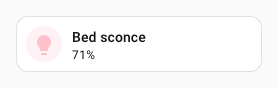

# Foundries

A **foundry** is a named UIX Forge configuration stored in Home Assistant. It acts as a reusable base configuration: define a `forge` and `element` config once, give it a name, and reference it in any number of elements with a single `foundry:` key. Local element config is merged on top, so you can still override any value per element.

## Managing foundries

Foundries can be managed in two ways: as **UI Foundries** configured directly in the Home Assistant UI (suitable for small numbers of foundries), or as **YAML File Foundries** stored on disk (better for larger sets, bulk authoring, and version control).

### UI Foundries

UI Foundries are configured directly through the Home Assistant integration UI and managed by the integration.

1. Go to **Settings → Devices & Services → UI eXtension → Configure (cog)**.
2. Choose **Manage UI foundries**, then one of the options:
   - **Add a foundry** — enter a name and a YAML config object.
   - **Edit a foundry** — select an existing foundry from the dropdown, then update its config.
   - **Delete a foundry** — select an existing foundry from the dropdown and confirm.

The foundry name must be unique. It is used as the `foundry:` key in your element config.

### YAML File Foundries

You can store foundries in ordinary YAML files anywhere inside (or accessible from) your HA config directory and register those files with UIX. This approach:

- supports version control (git, etc.)
- lets you use any text editor
- supports YAML anchors (`&`) and merge keys (`<<: *`) for DRY configurations
- supports `!include` and `!secret` directives (no quoting required — the file is loaded by HA's native YAML loader)

#### File format

Each file must have a top-level `uix_foundries` key whose value is a mapping of foundry names to foundry configs:

```yaml
uix_foundries:
  light_tile:
    forge:
      mold: card
    element:
      type: tile
      entity: light.bed_light

  switch_tile:
    forge:
      mold: card
    element:
      type: tile
      entity: switch.living_room
```

#### YAML anchors

YAML anchors and merge keys work well for sharing repeated values at the same level of a config. A common use-case is reusing formatting options across multiple entities in a `custom:multiple-entity-row` card:

```yaml
uix_foundries:
  browser_multiple_entity_anchors:
    forge:
      mold: row
      billets:
        id: my_browser_id
    element:
      type: custom:multiple-entity-row
      entity: binary_sensor.{{ id }}
      entities:
        - entity: sensor.{{ id }}_browser_battery
          <<: &width                    # define anchor inline on first use
            format: precision2
            styles:
              text-align: center
        - entity: sensor.{{ id }}_browser_height
          <<: *width                    # reuse the same formatting options
```

!!! warning "YAML merge keys are shallow"
    YAML merge keys (`<<: *anchor`) perform a **shallow** merge — they only copy top-level keys. This means they are not suitable for sharing a common `forge` + `element` base across multiple foundries, because merging at the foundry root level would replace the entire `element` object rather than merging its contents. Use [foundry nesting](foundries.md#foundry-nesting) instead, which performs a deep recursive merge.

#### Registering a file

1. Go to **Settings → Devices & Services → UI eXtension → Configure (cog)**.
2. Choose **Manage foundry files**, then **Register a foundry file**.
3. Enter the path to the file — either absolute or relative to the HA config directory (e.g. `uix/my_foundries.yaml`).

UIX validates the file before saving the registration. If the file cannot be found, fails to parse, or is missing the required `uix_foundries` key, an error is shown.

#### Reloading files

File contents are read when foundries are first requested by the browser and whenever foundries are updated. To force all connected browser sessions to reload the latest file contents without restarting Home Assistant:

1. Go to **Settings → Devices & Services → UI eXtension → Configure (cog)**.
2. Choose **Manage foundry files**, then **Reload foundry files**.

If your dashboard is in **YAML mode**, you can also use the dashboard's built-in **Refresh** button — UIX listens for the `config-refresh` event that the refresh button dispatches and automatically re-reads all registered foundry files.

Home Assistant developer tools YAML tab also has a `UIX Foundries` reload button which will show any errors in file foundries. *Available in v7.0.0-beta.6*

#### Removing a file registration

1. Go to **Settings → Devices & Services → UI eXtension → Configure (cog)**.
2. Choose **Manage foundry files**, then **Deregister a foundry file** and select the file from the dropdown.

This removes the registration only — the file itself is not deleted.

#### Precedence

When a foundry name appears in both a YAML file and a UI foundry, the **UI foundry takes precedence**. When the same name appears in multiple files, the **last registered file wins**.

## Using a foundry

Reference a foundry by name using the `foundry:` key:

```yaml
type: custom:uix-forge
foundry: my_tile
```

The foundry's `forge` and `element` configs are applied as if they were written directly on the UIX Forge config.

You can add or override any key locally — local values take precedence over the foundry:

```yaml
type: custom:uix-forge
foundry: my_tile
element:
  entity: light.kitchen
```

## Foundry config structure

A foundry is a YAML object that can contain any combination of `forge` and `element` keys:

```yaml
forge:
  mold: card
  uix:
    style:
      hui-tile-card $: |
        ha-card {
          --tile-color: red !important;
        }
element:
  type: tile
  entity: "{{ 'sun.sun' }}"
```

The same keys are valid here as on a normal `uix-forge` element. See the [UIX Forge](./index.md) for details on `forge` and `element` options.

## Including external files and secrets

Foundry configs support HA YAML directives such as `!include` and `!secret`. The behaviour differs slightly depending on whether the foundry is a UI Foundry or a YAML File Foundry.

- **In a YAML File Foundry** — the file is loaded by HA's native YAML loader, so `!include` and `!secret` work exactly as they do in `configuration.yaml`. No quoting is required.
- **In a UI Foundry** — foundries are entered as plain text in the browser. The browser's YAML parser does not understand `!` tags, so they must be quoted as string literals and are resolved by UIX at serve time.

!!! warning "Quoting required in UI Foundries"
    In the ObjectSelector / YAML editor in the HA UI, `!include` and `!secret` **must be quoted**. Write them as `"!include path/to/file.yaml"` or `"!secret my_key"`.

    In YAML File Foundries on disk they are unquoted, as in any other HA YAML file.

### `!include`

Use `!include` to replace any value with the contents of an external YAML file. The path is relative to the HA config directory.

```yaml
# /config/uix/my_forge_styles.yaml
style: "ha-card { background: teal; }"
```

```yaml
# In a YAML File Foundry — no quoting needed
uix_foundries:
  my_tile:
    forge:
      mold: card
    element:
      type: tile
      entity: "{{ config.entity }}"
      uix: !include uix/my_forge_styles.yaml
```

```yaml
# In a UI Foundry — must be quoted
forge:
  mold: card
element:
  type: tile
  entity: "{{ config.entity }}"
  uix: "!include uix/my_forge_styles.yaml"
```

The included file must contain the full value for the key it replaces. In the example above `my_forge_styles.yaml` contains a `uix` config dict (with a `style` key), so the `uix:` key of the element ends up as that dict after resolution.

### `!secret`

Use `!secret` to pull a value from `secrets.yaml` in the HA config directory.

```yaml
# /config/secrets.yaml
accent_colour: teal
lock_pin: "1234"
```

```yaml
# In a YAML File Foundry — no quoting needed
uix_foundries:
  my_tile:
    forge:
      mold: card
      billets:
        accent: !secret accent_colour
    element:
      type: tile
      entity: "{{ config.entity }}"
```

```yaml
# In a UI Foundry — must be quoted
forge:
  mold: card
  billets:
    accent: "!secret accent_colour"
element:
  type: tile
  entity: "{{ config.entity }}"
```

For more information on HA secrets see <https://www.home-assistant.io/docs/configuration/secrets/>.

## Merge behaviour

When a foundry is resolved, keys are merged in this order — later entries win:

1. **Foundry** — the stored foundry config.
2. **Local forge** — keys defined directly on the forge config.

For **object values** (e.g. `forge`, `element`), merging is recursive: nested keys are merged individually rather than the whole object being replaced. For **array and scalar values**, the local value replaces the foundry value entirely.

### Example

Foundry `weather_tile`:

```yaml
forge:
  mold: card
  macros:
    entity_color: "my_macros.jinja"
element:
  type: weather-forecast
  show_current: true
  show_forecast: false
```

Element config:

```yaml
type: custom:uix-forge
foundry: weather_tile
element:
  entity: weather.home
  show_forecast: true
```

Resolved config:

```yaml
forge:
  mold: card
  macros:
    entity_color: "my_macros.jinja"
element:
  type: weather-forecast
  entity: weather.home        # from element
  show_current: true          # from foundry
  show_forecast: true         # overridden by element
```

## Nested foundries

A foundry can itself reference another foundry using the `foundry` key. This lets you build a hierarchy of shared configs.

Foundry `base_tile`:

```yaml
forge:
  mold: card
  uix:
    style:
      hui-tile-card $: |
        ha-card {
          border-radius: 20px;
        }
element:
  type: tile
```

Foundry `light_tile` (extends `base_tile`):

```yaml
foundry: base_tile
element:
  vertical: false
  features_position: inline
  features:
    - type: light-brightness
```

Forge:

```yaml
type: custom:uix-forge
foundry: light_tile
element:
  entity: light.living_room
```

The resolved config merges all three layers: `base_tile` → `light_tile` → forge config.

!!! warning "Circular references"
    If a chain of foundry references loops back to a foundry already in the chain, UIX detects the cycle and throws an error. Always ensure your foundry hierarchy is acyclic.

## Billets in foundries

[Billets](../forge/index.md#billets) are a good fit for foundries because they act as named slots that individual forge instances can fill or override without touching the foundry templates.

There are two complementary patterns:

### Pattern 1 — define defaults in the foundry, override per instance

Define the billet with a sensible default in the foundry. Each instance can leave it as-is or override it with a local value. Templates in the foundry use the billet directly without needing any fallback logic.

Foundry `accent_tile`:

```yaml
forge:
  mold: card
  billets:
    accent: teal
element:
  type: tile
  entity: "{{ config.entity }}"
  uix:
    style: |
      ha-card {
        --tile-color: {{ accent }} !important;
      }
```

Instance — accepts the foundry default:

```yaml
type: custom:uix-forge
foundry: accent_tile
entity: light.bed_light
```


Instance — overrides the accent color:

```yaml
type: custom:uix-forge
foundry: accent_tile
entity: light.bed_light
forge:
  billets:
    accent: blue
```


### Pattern 2 — define empty billet slots in the foundry

When the foundry should not impose any value and the billet is expected to be supplied by the instance, define the billet as `~` (null). The foundry templates must then handle the `none` case gracefully, either by providing a fallback using `or` or `default()`, or by guarding with ``.

Foundry `flexible_tile`:

```yaml
forge:
  mold: card
  billets:
    accent: ~          # empty slot — instance is expected to override this
    label: ~           # optional label, templates handle none gracefully
element:
  type: tile
  entity: "{{ config.entity }}"
  name: "{{ label or state_attr(config.entity, 'friendly_name') }}"
  uix:
    style: |
      ha-card {
        
        --tile-color: {{ accent }} !important;
        
      }
```

Instance — supplies the accent, leaves label empty:

```yaml
type: custom:uix-forge
foundry: flexible_tile
entity: light.bed_light
forge:
  billets:
    accent: teal
```


Instance — supplies both billets:

```yaml
type: custom:uix-forge
foundry: flexible_tile
entity: light.bed_light
forge:
  billets:
    accent: pink
    label: Bed sconce
```



!!! note "UI Foundries: comments are stripped"
    Home Assistant stores UI foundry configs as JSON, so YAML comments are not preserved. Use descriptive billet names (e.g. `accent_color`, `card_label`) to make the purpose of each slot self-evident to anyone editing instances. YAML File Foundries stored on disk are not affected — comments in those files are preserved as usual.

## UIX styling from a foundry

A foundry can include a `uix` key under `forge` that applies [UIX styling](../using/index.md) to the forged element wrapper. Foundry styles are merged with any `uix` key in the local `forge` config, with the local forge config taking precedence.

!!! tip "Combining styles"
    If you need to have root styling and shadow root styling, use YAML selectors placing your root styling in the root key `.:`. If you use text only for `style:` on element you will override all yaml styles in foundries.

```yaml
# Foundry: "styled_tile"
forge:
  mold: card
  uix:
    style:
      hui-tile-card $: |
        ha-card {
          --tile-color: red !important;
        }
element:
  type: tile
```

```yaml
# Forge — adds its own uix style on top
type: custom:uix-forge
foundry: styled_tile
forge:
  uix:
    style:
      .: |
        :host {
          --ha-card-border-radius: 20px;
        }
element:
  entity: light.bed_light
```


