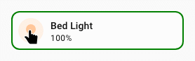
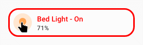
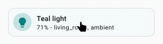
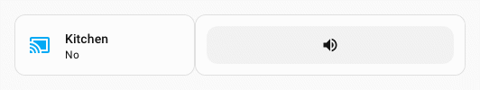
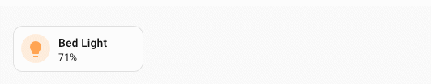
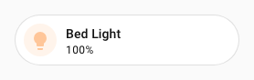
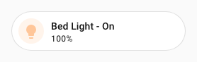

# UIX Forge

!!! info
    Billets are available in 6.3.0-beta.9

UIX Forge (`custom:uix-forge`) is a custom Lovelace element that combines template-driven configuration with additional behaviours called **sparks**. Use it to:

- **Forge** any standard Home Assistant element from templates, allowing the entire element config to react to entity states, user, browser and other template variables.
- **Add sparks** — self-contained behaviours that augment the forged element.
- **Apply UIX styles** to the forged element, exactly like any other element. Additionally any spark variables are made available in the `uixForge` template variable.

## Basic structure

```yaml
type: custom:uix-forge
forge:
  mold: card
  # optional sparks, macros, hidden, grid_options …
element:
  type: tile
  entity: "{{ 'sun.sun' }}"
  # any valid element config, templates supported
```

`forge` controls how UIX Forge itself behaves; `element` is the configuration of the Home Assistant element that will be rendered inside it.

## Forge options

| Key | Type | Allows Templates | Default | Description |
| --- | ---- | ---------------- | ------- | ----------- |
| `mold` | string | | (required) | How the element is forged, with each `mold` handling required forged element behaviours within Home Assistant Frontend. Currently `"card"`, `"badge"`, `"row"`, `"picture-element"` or `"section"`. |
| `macros` | mapping | | — | [template macros](../using/templates.md#macros) available to all templates in the forge config. Macros are also passed to `uix` config in both forge and forged element. See [UIX Styling - variables and macros](#variables-and-macros) |
| `billets` | mapping | | — | [billets](#billets) — named YAML values available as template constants in all templates in the forge config. See [Billets](#billets) |
| `hidden` | boolean | ✅ | `false` | When truthy the element is hidden. |
| `grid_options` | mapping | ✅ | — | Lovelace grid options (e.g. `rows`, `columns`) for when `mold` is `card`. Ignored for any other `mold`. |
| `show_error` | boolean | | `false` | When `true`, show the Lovelace error card instead of hiding it when the forged element errors. |
| `template_nesting` | string | | `"<<>>"` | Four-character string used to escape `{{ }}` in templates. Use when the element config itself contains Jinja2-like syntax. When nesting multiple forge layers deep, add an extra `<>` pair per additional layer (e.g. `"<<<>>>"` for two layers of nesting). |
| `sparks` | list | ✅ | `[]` | List of [spark](#sparks) configurations to attach to the forged element. |
| `delayed_hass` | boolean | | - | Flag to delay the passing of hass object to the card until after it is loaded. Used to suppress console errors or other issues for some custom cards. e.g. apexcharts_card. |

## Element config

Any valid Lovelace element configuration. Every string value in `element` is processed as a template, giving access to the same variables as [UIX templates](../using/templates.md) (`config`, `user`, `browser`, `hash`, `panel`).

The `uix` key inside `element` is passed through as is to [UIX Styling](../using/index.md), with [UIX Styling](../using/index.md) rendering any templates. Use it to style the forged element as you would any other element:

!!! example inline end "Forge example"
    

```yaml
type: custom:uix-forge
forge:
  mold: card
element:
  type: tile
  entity: light.bed_light
  uix:
    style: |
      ha-card {
        --tile-color: teal !important;
      }
```

### Template variables and macros

Macros from the forge are passed through to UIX Styling for both the forge and the forged element, making forge macros available to use in UIX Styling for both forge and forged element.

Templates will run in different contexts for forging, UIX styling the forge and UIX styling the element. The table below summarizes the different contexts.

| Context | Template variables |
| - | - |
| Templates in forge and element, except `uix` styling | **forge config**: `config.forge`<br/> **element config**: `config.element`<br/>`config.entity` is available if included in global `uix-forge` config. |
| Templates in forge `uix` styling | **forge config**: `config.forge`<br/>**element config**: `config.element`<br/>`config.entity` is available if included in global `uix-forge` config. |
| Templates in element `uix` styling. Here the template is run in regular `uix` styling context for the forged element | **forge config**: unavailable<br/>**element config**: `config`<br/>`config.entity` is available if included in global `uix-forge` config. |

!!! tip
    If you specify `entity` on global `uix-forge` config it will always be available no matter the context. You always need to specifically specify the element entity if it needs one - you can use a template to use `config.entity`.
    ```yaml
    type: custom:uix-forge
    entity: light.bed_light
    forge:
      mold: card
    element:
      type: tile
      entity: "{{ config.entity }}"
      uix:
        style: |
          :host {
            --ha-card-border-color: {{ 'green' if is_state(config.entity, 'on') else 'red' }};
            --ha-card-border-width: 2px;
          }
    ```

    

#### Full example including macro

!!! example inline end "Full example including macro"
    

```yaml
type: custom:uix-forge
entity: light.bed_light
forge:
  mold: card
  macros:
    state_color:
      params:
        - entity_id
      template: "{{ 'red' if is_state(entity_id, 'on') else 'green' }}"
  uix:
    style: |
      :host {
        --ha-card-border-radius: 20px;
        --ha-card-border-color: {{ state_color(config.entity) }};
        --ha-card-border-width: 3px;
      }
element:
  type: tile
  entity: "{{ config.entity }}"
  name: "{{ device_name(config.entity) }} - {{ state_translated(config.entity) }}"
  uix:
    style: |
      span.primary {
        color: {{ state_color(config.entity) }};
      }
```

### Billets

!!! info
    Billets are available in 6.3.0-beta.9

Billets are named YAML values defined under `forge.billets`. They are available as template constants in all forge templates **and** in any `uix:` style on the forge card or the forged element, and can be used **without parentheses**, unlike macros. Billets are purely static values — they cannot contain Jinja2 templates themselves.

```yaml
type: custom:uix-forge
entity: light.bed_light
forge:
  mold: card
  grid_options:
    columns: 7
  billets:
    my_color: teal
    max_brightness: 255
    tags:
      - living_room
      - ambient
element:
  type: tile
  entity: "{{ config.entity }}"
  name: "{{ my_color | capitalize }} light"
  tap_action:
    action: perform-action
    perform_action: light.turn_on
    target:
      entity_id: "{{ config.entity }}"
    data:
      brightness: "{{ max_brightness }}"
  uix:
    style: |
      ha-card {
        --tile-color: {{ my_color }} !important;
      }
      ha-tile-info span:nth-of-type(2):after {
      
        content: ' - {{ tags | join(', ') }} - MAX';
        font-weight: 900;
      
        content: ' - {{ tags | join(', ') }}';
      
      }
```



#### Billet types

The YAML type of a billet determines how it is represented in templates:

| YAML type | Example | Jinja2 type | Template usage |
| --------- | ------- | ----------- | -------------- |
| Empty (`~` or `null`) | `my_billet: ~` | `none` | `{{ my_billet }}` → empty |
| String | `my_billet: hello` | `str` | `{{ my_billet }}` → `hello` |
| Number | `my_billet: 42` | `int` or `float` | `{{ my_billet + 1 }}` → `43` |
| Boolean | `my_billet: true` | `bool` | `…` |
| List | `my_billet: [1, 2, 3]` | `list` | `{{ my_billet | join(', ') }}` |
| Mapping | `my_billet: {a: 1}` | `dict` | `{{ my_billet.a }}` |

Each billet is injected as a `` statement, preserving the native Jinja2 type for all YAML types — no macro wrapper is needed.

#### Billets and foundries

!!! info
    Billets are available in 6.3.0-beta.9

Billets follow the same override behaviour as macros: a foundry can define billets, and local forge config can override individual billet entries. Only the billets whose names are referenced in a template are included in that template's preamble.

See [Billets in foundries](./foundries.md#billets-in-foundries) for patterns on defining empty billet slots in a foundry and handling the `none` case in templates.

### Template nesting

If the element you are forging uses Jinja style templates or same markers (e.g. ha-nunjucks) then you will need to nest these templates. The default nesting characters are `<<>>`. This can be adjusted in forge config if required.

??? warning "Read if you wish to create your own nesting sequence"
    When using template nesting, the template nesting characters `<<>>` are replaced with Jinja `raw` directives before the template is rendered. he replacement includes a marker for internal readiness code to be able to recognise a rendered template with nesting. `<<` is replaced with `{#uix#}{{` and `>>` is replaced with `}}{#uix#}`. If you try and create this sequence without using the nesting shorthand, it must be replicated EXACTLY for forge internal readiness checks to complete.

When there are multiple forge layers, each additional layer requires one extra `<` / `>` pair (e.g. `<<<` / `>>>` for two levels). UIX strips one nesting level internally at each intermediate forge layer, so the correct number of delimiters reaches the final forge layer automatically — you only need to set `template_nesting` to the total number of layers deep the value needs to travel.

??? example "Multiple nesting levels example"
    ```yaml
    type: custom:uix-forge
    entity: media_player.kitchen # overall entity in global uix-forge config
    forge:
      mold: card
      sparks:
        - type: grid
          for: "hui-grid-card $ #root"
          columns: 40% auto
          column_gap: 0px
    element:
      type: grid
      square: false
      cards:
        - type: custom:uix-forge
          entity: "{{ config.entity }}" # use config.entity directly for nested forge
          forge:
            mold: card
          element:
            entity: "{{ config.entity }}" # use config.entity directly for nested forge element
            type: tile
            state_content: is_volume_muted
        - type: custom:uix-forge
          entity: "{{ config.entity }}" # use config.entity directly for nested forge
          forge:
            mold: card
          element:
            type: custom:custom-features-card
            features:
              - type: custom:service-call
                entries:
                  - type: button
                    entity_id: << config.entity >> # use first level nesting
                    icon: mdi:volume-high
                    haptics: true
                    tap_action:
                      action: perform-action
                      perform_action: media_player.volume_mute
                      target:
                        entity_id: |
                          <<< config.entity >>> {# use second level nesting #}
                      data:
                        is_volume_muted: true
    ```

    

### Using with auto-entities

UIX Forge supports `custom:auto-entities` in two ways:

1. When UIX Forge is used as the main card for auto-entities, UIX Forge accepts and passes through `entities` to the element config, though will not be available on `config.element.entities`
2. When using UIX Forge as an entity card via auto-entities include filter `options`, UIX Forge accepts `entity` that auto-entities passes through, but does not pass through to element config. It will be available in templates using `config.entity` and you can use `{{ config.entity }}` when you need to specify an entity for the card options.

??? example "auto-entities example"
    ```yaml
    type: custom:auto-entities
    filter:
      include:
        - options:
            type: custom:uix-forge
            # auto-entities will populate entity in config, so we can use it in templates
            forge:
              mold: card
              sparks:
                - type: tooltip
                  for: hui-tile-card $ ha-card
                  content: >-
                    {{ state_attr(config.entity,
                    'friendly_name') }} is {{ states(config.entity) }}
            element:
              entity: "{{ config.entity }}"
              type: tile
          area: bedroom
      exclude: []
    card:
      square: false
      type: grid
    show_empty: true
    card_param: cards
    ```

    

## UIX styling

Add a `uix` key under `forge` to apply [UIX styling](../using/index.md) to the forge element wrapper itself. Template variables `config.forge`, `config.element`, and `uixForge` are available in the style templates, where `config.forge` and `config.element` are the resolved forge and element configs and `uixForge` contains any [spark](./sparks/tooltip.md) template variables. `config.entity` will also be available if set in the global `uix-forge` config.

```yaml
type: custom:uix-forge
forge:
  mold: card
  uix:
    style: |
      :host {
        --ha-card-border-radius: 50px;
      }
element:
  type: tile
  entity: light.bed_light
```



### Element styling

UIX Styling can be applied to the element in the usual way. Only the usual `config` variable is available which is the standard variable resolved by UIX Styling for elements.

!!! warning
    Element UIX Styling will **NOT** contain the forge and spark variables available in forge UIX Styling. If you wish to use these then use UIX Styling on the forge rather than the forged element.

```yaml
type: custom:uix-forge
forge:
  mold: card
  uix:
    style: |
      :host {
        --ha-card-border-radius: 50px;
      }
element:
  type: tile
  entity: light.bed_light
  uix:
    style: |
      span.primary::after {
        content: ' - {{ state_translated(config.entity) }}';
      }
```



## Sections

When using UIX Forge for a section in sections view, use the YAML section editor (use three dots menu) and change type to `custom: uix-forge`. Set forge `mold` to `section`.

When using UIX Forge for sections, the following config keys can be set directly to configure how the section shows, though they **do not support templates**:

- `row_span`
- `column_span`
- `background`

```yaml
type: custom:uix-forge
forge:
  hidden: # use hidden to control visibility, templates supported
  # ...
element:
  # ...
# section only main configuration keys. Visibility not supported.
row_span: # row span for section
column_span: # column span for section
background: # background for section
```

When editing the dashboard in UI mode, the section will be surrounded by red dashed border to show that it is configured by UIX Forge in YAML. All cards contained in the section will show in preview mode, but will not be editable. Use YAML for editing the section.

!!! warning
    Visibility in the main config is not supported. Though the Home Assistant visual editor will let you set visibility you will get an error as soon as you save the section. If you need Frontend visibility options not supported by template (screen) use a stack card as your element and set Frontend visibility on that element, templates supported.

## Foundries

A **foundry** is a server-stored UIX Forge template that lets you define reusable `forge`, `element`, and `uix` configs once and share them across many cards. Reference a foundry with the `foundry:` key and override only what you need locally.

See [Foundries](./foundries.md) for a full guide including merge behaviour, nested foundries, and management via the integration options.

## Sparks

Sparks are optional behaviours that you add to the `forge.sparks` list. Each spark has a `type` key and its own options.

Available sparks:

- :speech_balloon: [Tooltip](./sparks/tooltip.md) — attach a styled tooltip to any element inside the forged element.
- :material-button-cursor: [Button](./sparks/button.md) - attach a styled button (`ha-button`) with actions as a sibling before or after any element within the forged element.
- :label: [Attribute](./sparks/attribute.md) — add, replace or remove an attribute of any element within the forged element.
- :zap: [Event](./sparks/event.md) — receive DOM events from `fire-dom-event` actions and expose their data as template variables.
- :star: [Tile Icon](tile-icon.md) — insert a `ha-tile-icon` element as a sibling before or after any element within the forged element.
- :shield: [State badge](./sparks/state-badge.md) - insert a `state-badge` element as a sibling before or after any element within the forged element.
- :material-grid: [Grid](./sparks/grid.md) - apply **CSS Grid** layout to any container element inside a forged element
- :mag: [Search](./sparks/search.md) - queries a container within a forged element with a CSS selector and optional inner text to find, then apply mutations to the found element(s).
- :material-map: [Map](./sparks/map.md) — preserve the zoom level and centre of a map card across Home Assistant state updates.
- :material-lock: [Lock](./sparks/lock.md) — overlay a lock icon on any element to block interaction until the user passes a PIN, passphrase, or confirmation challenge.
