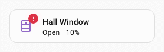
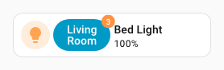
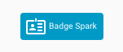

# :material-badge-account-horizontal-outline: Badge spark

The `badge` spark inserts a `uix-badge` as a DOM sibling immediately before or after an element within a forged element. It uses Home Assistant's patched Web Awesome badge base and styles, so its colors automatically follow the active Home Assistant theme.

When the target is an `ha-button` or `ha-tile-icon`, UIX automatically shows the badge on that element using compact styling. These are the only targets with automatic placement.

`uix-badge` is namespaced to UIX. UIX does not import or register Web Awesome's global `wa-badge` component.

## Basic usage

Add a `badge` entry to `forge.sparks` with either `after` or `before` to locate the reference element.

```yaml
type: custom:uix-forge
forge:
  mold: card
  sparks:
    - type: badge
      after: hui-tile-card $ ha-tile-icon
      content: 3
      variant: danger
      pill: true
element:
  type: tile
  entity: light.bed_light
```


## Configuration

| Key | Type | Required | Default | Description |
| --- | --- | --- | --- | --- |
| `type` | string | ✅ | — | Must be `badge`. |
| `after` | string | one of `after` / `before` ✅ | When using [Blank card config](../forge.md#blank-card-config), the default is `uix-forge-blank-card $ div.content`; otherwise `""`. | UIX selector for the reference element. Normally, the badge is inserted after it. For an `ha-button` or `ha-tile-icon`, the badge is shown on that element instead. With `placement` set for any other element type, the badge is positioned on its parent. |
| `before` | string | one of `after` / `before` ✅ | — | UIX selector for the reference element. Normally, the badge is inserted before it. For an `ha-button` or `ha-tile-icon`, the badge is shown on that element instead. With `placement` set for any other element type, the badge is positioned on its parent. |
| `content` | string or number | | `""` | Text shown in the badge. |
| `variant` | string | | `brand` | `brand`, `neutral`, `success`, `warning`, or `danger`. |
| `appearance` | string | | `accent` | `accent`, `filled`, `outlined`, or `filled-outlined`. |
| `pill` | boolean | | `false` | Use the fully rounded pill shape. |
| `attention` | string | | `none` | `none`, `pulse`, or `bounce`. When `pulse`, `accent` and `filled` use their fill color; `outlined` and `filled-outlined` use their border color. Set the pulse color directly with `--uix-badge-attention-color`. |
| `placement` | string | | — | For `ha-button` and `ha-tile-icon`, chooses where on the element the badge appears. For any other target, positions the badge on its parent instead of inserting it as a sibling. All placement options use compact `var(--ha-font-size-xs)` text with `0.25em 0.5em` padding. `top`, `top-start`, `top-end`, `bottom`, `bottom-start`, `bottom-end`, `left`, `left-start`, `left-end`, `right`, `right-start`, or `right-end`. |
| `start_icon` / `end_icon` | string | | — | MDI icon before or after the badge content. |
| `style` | object | | — | Flat map of CSS property names and string or numeric values, set inline on this `uix-badge`. |

!!! note
    - The spark targets the first element matched by `after` or `before`.
    - The inserted badge is a sibling of the target, not a child, except when it is automatically placed on an `ha-button` or `ha-tile-icon`.
    - `content` is inserted as text, not HTML.
    - In a tile card, target `ha-tile-icon` to place the badge in its corner. Do not target `ha-tile-info`, which occupies the remaining row width.

## Automatic placement

UIX automatically places badges on exactly two Home Assistant elements:

| Target | Placement | Implementation |
| --- | --- | --- |
| `ha-button` | Top-end corner | The badge is added inside the button, matching Web Awesome's button-badge pattern. Its diameter aligns with the button's rendered top and end edge. A UIX-generated button spark is also recognised. |
| `ha-tile-icon` | Top-end corner | The badge is placed in the tile icon's documented default slot, using Home Assistant's own tile-badge corner offsets and compact tile-badge sizing. |

For these targets, `after` and `before` identify the element that receives the badge; they do not control sibling insertion. Without `placement`, every other target type keeps normal sibling behavior.

The built-in Home Assistant Button card (`hui-button-card`) does not contain an `ha-button`; it uses slots for its icon and label. Without `placement`, it has normal sibling behavior. Set `placement` to position the badge on the Button card's parent.

UIX does not automatically position badges on arbitrary buttons, cards, or custom elements. Those elements have different slots and layout rules, so placement on their parent is enabled only when `placement` is explicitly set.

### Placement on other elements

Setting `placement` on any other target positions the badge at the edge of that target's parent. UIX keeps the badge outside the target and does **not** measure or alter the selected target.

This is useful when the target fills its parent, such as a built-in Button card inside its card container. If the parent contains several visible elements, the placement is relative to the whole parent rather than one child. Use `--uix-badge-offset-x` and `--uix-badge-offset-y` for final adjustment.

All placement modes use Home Assistant's compact `--ha-font-size-xs` font size and tight `0.25em 0.5em` padding by default, keeping badge size consistent.

Offsets accept CSS percentages as well as lengths. For a `right`, `top-end`, or `bottom-end` badge, set `--uix-badge-offset-x: -50%` to cancel the default half-width corner overlap and align every badge by its logical end edge, regardless of content width. Combine it with a length when needed, for example `calc(-50% - 20px)`. For `left`, `top-start`, or `bottom-start`, use `50%` to align the logical start edge instead.

Set `placement` using the same values as `wa-tooltip`: `top`, `top-start`, `top-end`, `bottom`, `bottom-start`, `bottom-end`, `left`, `left-start`, `left-end`, `right`, `right-start`, and `right-end`. `ha-button` and `ha-tile-icon` default to `top-end`. For every other target, providing `placement` positions the badge on the parent; omitting it keeps the badge as a normal sibling.

## CSS variables

Set these variables on `uix-badge` or an ancestor. For a single Forge or Broker badge, use its `style` map. They work for both Forge and Broker badges.

| Variable | Default | Description |
| --- | --- | --- |
| `--uix-badge-font-size` | `max(var(--wa-font-size-3xs, var(--ha-font-size-xs)), 0.75em)`; `var(--ha-font-size-xs)` when placement is active | Badge text size. The normal default is Web Awesome's smallest font token or 75% of the inherited font size, whichever is larger. |
| `--uix-badge-font-weight` | `var(--wa-font-weight-semibold)` | Badge text and icon weight. |
| `--uix-badge-padding` | `0.375em 0.625em`; `0.25em 0.5em` when placement is active | Padding inside the badge. |
| `--uix-badge-min-width` | `calc(1.5em + 2px)` when placement is active | Minimum badge width. It includes the default 1px border on each side, keeping a placed one-character badge, such as `!`, from appearing too narrow. |
| `--uix-badge-max-width` | `none` | Maximum rendered badge width. |
| `--uix-badge-overflow` | `visible` | How content beyond the badge width is handled. Use `hidden` or `clip` with `--uix-badge-max-width` to contain it. |
| `--uix-badge-color` | Web Awesome appearance fill | Badge background color. |
| `--uix-badge-content-color` | Web Awesome appearance color | Badge text and icon color. |
| `--uix-badge-border` | Web Awesome border | Complete CSS `border` value, for example `1px solid rgb(255 255 255 / 50%)`. It supplies the border width, style, and color. |
| `--uix-badge-border-color` | Web Awesome border color | Badge border color. Falls back to `--uix-badge-color` when it is set. |
| `--uix-badge-box-shadow` | `none` | CSS `box-shadow` applied to the badge. |
| `--uix-badge-attention-color` | Web Awesome appearance fill or border | Pulse-ring color for `attention: pulse`. By default, `accent` and `filled` use their fill color; `outlined` and `filled-outlined` use their border color. |
| `--uix-badge-color-hover` | Non-hover background color | Badge background color while hovered. |
| `--uix-badge-content-color-hover` | Non-hover content color | Badge text and icon color while hovered. |
| `--uix-badge-border-color-hover` | Non-hover border color | Badge border color while hovered. |
| `--uix-badge-attention-color-hover` | Non-hover attention color | Pulse-ring color while hovered. |
| `--uix-badge-pointer-events` | `auto` when placement is active | Set to `none` to let pointer events pass through a placed badge. This disables its hover state. |
| `--uix-badge-z-index` | `auto`; `1` when placement is active | Stack order of a placed badge. |
| `--uix-badge-offset-x` | `0px` | Horizontal adjustment applied after resolving placement. Positive moves right. |
| `--uix-badge-offset-y` | `0px` | Vertical adjustment applied after resolving placement. Positive moves down. |

The color variables, including their `-hover` forms, are passed directly to CSS. They accept any CSS color value, including translucent `rgba()` or modern space-separated `rgb()` values with an alpha channel.

With `attention: pulse`, `--uix-badge-box-shadow` remains as static shadow layers and UIX appends the expanding pulse ring.

Placed badges accept pointer input, so their hover colors apply only while the pointer is over the badge itself.

For example, this moves a placed badge two pixels inward from its resolved end edge:

```yaml
type: custom:uix-forge
forge:
  mold: card
  sparks:
    - type: badge
      after: hui-tile-card $ ha-tile-icon
      content: 3
      variant: danger
      pill: true
      style:
        "--uix-badge-offset-x": -2px
        "--uix-badge-offset-y": -2px
element:
  type: tile
  entity: light.bed_light
```


## Examples

### Status badge

`ha-tile-info` is styled to `flex: 1` so it shrinks to allow room for the added badge sibling.

```yaml
type: custom:uix-forge
forge:
  mold: card
  sparks:
    - type: badge
      after: hui-tile-card $ ha-tile-info
      content: Experimental
      variant: warning
      appearance: outlined
      start_icon: mdi:flask-outline
element:
  type: tile
  entity: light.bed_light
  uix:
    style: |
      ha-tile-info {
        flex: 1;
      }
```


### Attention badge

```yaml
type: custom:uix-forge
forge:
  mold: card
  sparks:
    - type: badge
      after: hui-tile-card $ ha-tile-icon
      content: |
        {{ '!' if is_state('cover.hall_window', 'open') else '⎷' }}
      variant: |
        {{ 'danger' if is_state('cover.hall_window', 'open') else 'success' }}
      pill: true
      attention: |
        {{ 'pulse' if is_state('cover.hall_window', 'open') else 'none' }}
element:
  type: tile
  entity: cover.hall_window
```



### Generic Button-card placement

The built-in Button card does not have automatic badge placement. Because it fills this Forge card's parent, an explicit `placement` safely positions the badge there without touching the Button card's internal DOM.

```yaml
type: custom:uix-forge
forge:
  mold: card
  sparks:
    - type: badge
      after: hui-button-card
      content: 3
      variant: danger
      pill: true
      placement: top-end
      style:
        "--uix-badge-offset-x": -6px
        "--uix-badge-offset-y": 6px
        "--uix-badge-font-size": 24px
element:
  type: button
  entity: light.bed_light
```


### Badge on a button spark

A Forge `button` spark uses a `display: contents` wrapper. A later badge spark can target that wrapper, as shown below; UIX recognises it and attaches the badge to the contained `ha-button` rather than placing it beside the wrapper.

```yaml
type: custom:uix-forge
forge:
  mold: card
  sparks:
    - type: button
      after: hui-tile-card $ ha-tile-icon
      label: Living Room
    - type: badge
      after: "hui-tile-card $ div[data-uix-forge-button-id]"
      content: 3
      variant: danger
      pill: true
element:
  type: tile
  entity: light.bed_light
```



### UIX Blank card badge

Show a badge as a card using UIX Forge blank card. UIX styling is used to style card border and background as unset so the badge itself remains as the main UI element. UIX Styling of `ha-card` in shadow root of `uix-forge-blank-card` justifies the badge to be centered horizontally.

```yaml
type: custom:uix-forge
forge:
  mold: card
  grid_options:
    columns: 3
  sparks:
    - type: badge
      after: uix-forge-blank-card $ div.content
      content: Badge Spark
      variant: brand
      start_icon: mdi:badge-account-horizontal-outline
  uix:
    style:
      .: |
        :host {
          --ha-card-border-width: 0px;
          --ha-card-background: none;
        }
      uix-forge-blank-card $: |
        ha-card {
          display: flex;
          justify-content: center;
        }
```


