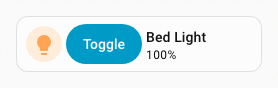
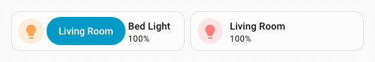
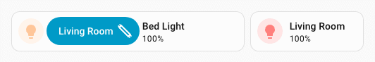
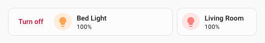
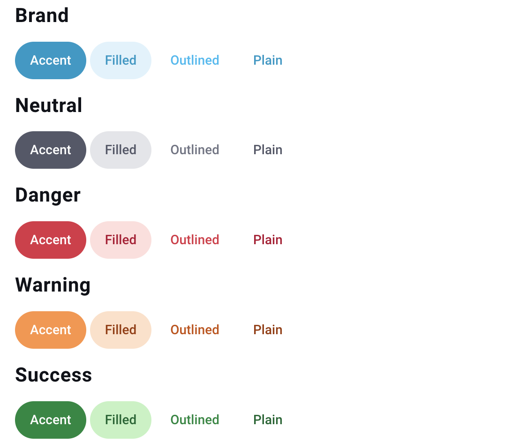

# :material-button-cursor: Button spark

The `button` spark inserts a Home Assistant [`ha-button`](https://github.com/home-assistant/frontend/tree/dev/src/components/ha-button.ts) element as a DOM sibling immediately **before** or **after** a target element inside a forged element.

The button can display:

- a text label (`label`)
- an icon in the label position (`icon`)
- a leading icon (`start_icon`)
- a trailing icon (`end_icon`)

`icon` and `label` are mutually exclusive — when `icon` is set, the icon is placed in `ha-button`'s label slot and `label` is ignored.

When only `icon` is set (no `label`), the button automatically receives styling to match Home Assistant's icon button.

Optionally the button can be made interactive with tap/hold/double-tap [actions](#actions).

## Basic usage

Add a `button` entry to `forge.sparks` with either `after` or `before` to specify the target element and where the button is inserted relative to it.

The `after`/`before` value is a selector that locates the target element within the forged element. It supports the same [DOM navigation syntax](../../concepts/dom.md) as UIX styles, including `$` to cross shadow-root boundaries.

```yaml
type: custom:uix-forge
forge:
  mold: card
  sparks:
    - type: button
      after: hui-tile-card $ ha-tile-icon
      label: Toggle
      entity: light.living_room
      tap_action:
        action: toggle
element:
  type: tile
  entity: light.living_room
```



!!! tip
    You can use the [`uix_forge_path()`](../../concepts/dom.md#uix_forge_path0-forge-helper) DOM helper to take the guesswork out of finding the right path for `after`/`before`.

## Configuration

| Key | Type | Required | Default | Description |
| --- | ---- | -------- | ------- | ----------- |
| `type` | `string` | ✅ | — | Must be `button`. |
| `after` | `string` | one of `after`/`before` ✅ | — | UIX selector for the reference element. The button is inserted as a sibling **after** the matched element. |
| `before` | `string` | one of `after`/`before` ✅ | — | UIX selector for the reference element. The button is inserted as a sibling **before** the matched element. |
| `entity` | `string` | | — | Entity ID passed to action handlers (e.g. `toggle`). Required for entity-based actions. |
| `icon` | `string` | | — | MDI icon string (e.g. `mdi:lightbulb`) placed in the label slot of the button. Mutually exclusive with `label`. |
| `color` | `string` | | — | Icon color when in icon-only mode (e.g. `red`, `var(--primary-color)`). Only applied when `icon` is set. |
| `label` | `string` | | `""` | Text label displayed inside the button. Mutually exclusive with `icon`. |
| `start_icon` | `string` | | — | MDI icon string (e.g. `mdi:play`) displayed **before** the label. |
| `end_icon` | `string` | | — | MDI icon string (e.g. `mdi:chevron-right`) displayed **after** the label. |
| `variant` | `string` | | — | Button color variant. One of `brand`, `neutral`, `danger`, `warning`, `success`. When omitted, the default Home Assistant button variant `brand` is used, except when `icon` is set in which case `neutral` is default. |
| `appearance` | `string` | | — | Button appearance. One of `accent`, `filled`, `plain`. When omitted, the default Home Assistant button appearance `accent` is used, except when `icon` is set in which case `plain` is default. |
| `size` | `string` | | — | Button size which can be `small` or `medium`. |
| `tap_action` | action | | — | Action to perform on tap. |
| `hold_action` | action | | — | Action to perform on hold. |
| `double_tap_action` | action | | — | Action to perform on double tap. |

!!! note
    - Exactly one of `after` or `before` must be provided.
    - The spark targets the **first** element matched by `after`/`before`.
    - The inserted `ha-button` is placed in a containing `<div>` inside the same parent as the target element — it is a sibling, not a child.
    - `icon` and `label` are mutually exclusive. When `icon` is set, `label` is ignored.
    - Margin styling of `-6px` is applied which allows the button to align nicely in various places in Home Assistant. This margin can be controlled by the CSS variable `--uix-button-margin`.
    - When only `icon` is set (no `label`), the button automatically receives styling to match Home Assistant's icon button.

## Actions

When one or more action keys are set (`tap_action`, `hold_action`, `double_tap_action`), the button fires the corresponding Home Assistant action. Provide `entity` when using entity-based actions such as `toggle` or `more-info`.

```yaml
type: custom:uix-forge
forge:
  mold: card
  sparks:
    - type: button
      after: hui-tile-card $ ha-tile-icon
      label: Living Room
      entity: light.living_room_rgbww_lights
      tap_action:
        action: toggle
      hold_action:
        action: more-info
element:
  type: tile
  entity: light.bed_light
```



!!! note
    When used inside a tile card the button's click events are isolated from the tile card's own action handler — only the button's configured actions fire.

## Examples

??? example "Button after the tile icon with a toggle action and fluorescent light icon"
    ```yaml
    type: custom:uix-forge
    forge:
      mold: card
      grid_options:
        columns: 9
      sparks:
        - type: button
          after: hui-tile-card $ ha-tile-icon
          label: Living Room
          end_icon: mdi:lightbulb-fluorescent-tube-outline
          entity: light.living_room_rgbww_lights
          tap_action:
            action: toggle
    element:
      type: tile
      entity: light.bed_light
    ```

    

??? example "Button before the tile icon with a danger variant"
    ```yaml
    type: custom:uix-forge
    forge:
      mold: card
      sparks:
        - type: button
          before: hui-tile-card $ ha-tile-icon
          label: Turn off
          variant: danger
          appearance: plain
          entity: light.living_room
          tap_action:
            action: call-service
            service: light.turn_off
            target:
              entity_id: light.living_room
    element:
      type: tile
      entity: light.bed_light
    ```

    

??? example "Button with start and end icons"
    ```yaml
    type: custom:uix-forge
    forge:
      mold: card
      sparks:
        - type: button
          after: hui-tile-card $ ha-tile-icon
          start_icon: mdi:play
          label: Scene
          end_icon: mdi:chevron-right
          tap_action:
            action: navigate
            navigation_path: /lovelace/scenes
    element:
      type: tile
      entity: light.bed_light
    ```

??? example "Icon-only button"
    ```yaml
    type: custom:uix-forge
    forge:
      mold: card
      sparks:
        - type: button
          before: hui-tile-card $ ha-tile-info
          icon: mdi:lightbulb
          color: var(--warning-color)
          entity: light.living_room
          tap_action:
            action: toggle
    element:
      type: tile
      entity: light.bed_light
    ```

??? example "Button with tile card styling for spacing with flex css properties"
    Also included is a [:speech_balloon: Tooltip spark](tooltip.md)
    ```yaml
    type: custom:uix-forge
    forge:
      mold: card
      grid_options:
        columns: 12
        rows: 1
      sparks:
        - type: tooltip
          for: hui-tile-card $ ha-button
          content: Toggle Special Switch
        - type: button
          after: hui-tile-card $ ha-tile-info
          label: Press me
          variant: neutral
          appearance: plain
          end_icon: mdi:test-tube
          entity: input_boolean.test_boolean
          tap_action:
            action: toggle
          hold_action:
            action: more-info
    element:
      type: tile
      entity: light.bed_light
      vertical: false
      features_position: bottom
      uix:
        style: |
          ha-tile-info {
            flex: 2;
          }
          ha-button {
            margin-top: -2px;
            flex: 1;
          }
    ```

## Variant and appearance

Button `variant` can be one of `brand`, `neutral`, `danger`, `warning`, `success`. When omitted, the default Home Assistant button variant `brand` is used.

Button `appearance` can be one of `accent`, `filled`, `plain`. When omitted, the default Home Assistant button appearance `accent` is used.

!!! info "Button variant and appearance image"
    
