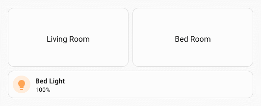
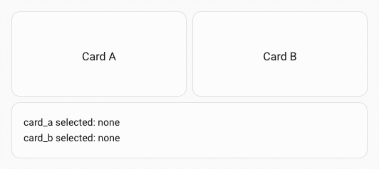
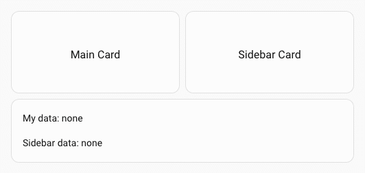
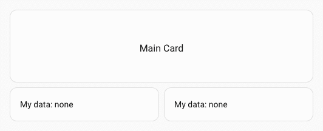

# :zap: Event spark

The `event` spark receives events fired with Home Assistant action `fire-dom-event` and exposes the received data as template variables inside forged element. Use it to build cards that react to user interactions or automation-triggered events elsewhere in the dashboard.

## Configuration

| Key | Type | Required | Default | Description |
| --- | ---- | -------- | ------- | ----------- |
| `type` | `string` | ✅ | — | Must be `event`. |
| `forge_id` | `string` | | — | ID for this forge element. Data from `fire-dom-event` events whose `forge_id` matches is spread directly into `uixForge.event`. |
| `other_forge_ids` | list of strings | | — | IDs of other forge elements to listen to. Data for each ID is available as `uixForge.event.<id>`. |

At least one of `forge_id` or `other_forge_ids` should be set for the spark to receive anything.

## Template variables

When the event spark is active, an `event` key is added to the `uixForge` template variable:

| Variable | Description |
| -------- | ----------- |
| `uixForge.event.<key>` | Data keys from events matching `forge_id`, spread directly into `uixForge.event`. |
| `uixForge.event.<other_id>.<key>` | Data from events matching an ID listed in `other_forge_ids`, nested under that ID. |

By default, data accumulates across events — each new event is deep-merged into the existing state. To have the event data replaced use `replace: true` (Available since 7.6.0-beta.1).

## Firing an event

Any Home Assistant element that supports `tap_action` can fire an event using `action: fire-dom-event`. Add a `uix_forge` key alongside `action` containing a list of forge event objects.

```yaml
tap_action:
  action: fire-dom-event
  uix_forge:
    - forge_id: my_card
      # replace: false
      data:
        selected: living_room
```

## Usage

### Basic example — a button that updates a card

Two button cards fire DOM events; a UIX forge receives it and updates its template:

```yaml
type: button
name: Living Room
tap_action:
  action: fire-dom-event
  uix_forge:
    - forge_id: my_tile
      data:
        entity: light.living_room_rgbww_lights
```

```yaml
type: button
name: Bed Room
tap_action:
  action: fire-dom-event
  uix_forge:
    - forge_id: my_tile
      data:
        entity: light.bed_light
```

Forged tile that receives and changes tile entity based on event data, with a default which will be used initially as there will be no event data.

```yaml
type: custom:uix-forge
forge:
  mold: card
  grid_options:
    rows: 1
    columns: full
  sparks:
    - type: event
      forge_id: my_tile
element:
  type: tile
  entity: "{{ uixForge.event.entity | default('light.bed_light') }}"
```



### Listening to another forged element's events

Use `other_forge_ids` to receive events intended for a different forged element. The data is then available under `uixForge.event.<forge_id>`:

!!! tip
    While `uixForge.event` will always exist as a template variable, `uixForge.event.<forge_id>` will not so you need to check for its existence in the dict prior to accessing, otherwise your template will error. If you are unsure of why a template is not working as expected, you can always use [template debugging](../../debugging/templates.md) with `{# uix.debug #}`.

Two button cards fire DOM events; a UIX forge receives as `other_forge_ids`:

```yaml
type: button
name: Card A
tap_action:
  action: fire-dom-event
  uix_forge:
    - forge_id: card_a
      data:
        selected: Selected
```

```yaml
type: button
name: Bed Room
tap_action:
  action: fire-dom-event
  uix_forge:
    - forge_id: card_b
      data:
        entity: Selected
```

```yaml
type: custom:uix-forge
forge:
  mold: card
  sparks:
    - type: event
      other_forge_ids:
        - card_a
        - card_b
element:
  type: markdown
  content: |
    card_a selected: {{ uixForge.event.card_a.selected if "card_a" in
    uixForge.event else 'none' | default('none') }} 
    card_b selected: {{ uixForge.event.card_b.selected if "card_b" in 
    uixForge.event else 'none' | default('none') }}
```



### Combining own ID and other IDs

You can set both `forge_id` and `other_forge_ids` simultaneously.

Two button cards fire DOM events; a UIX forge receives as `forge_id` and `other_forge_ids`:

```yaml
type: button
name: Main Card
tap_action:
  action: fire-dom-event
  uix_forge:
    - forge_id: main-card
      data:
        selected: "Hello main_card!"
```

```yaml
type: button
name: Sidebar Card
tap_action:
  action: fire-dom-event
  uix_forge:
    - forge_id: sidebar_card
      data:
        data_key: "Hello sidebar_card!"
```

```yaml
type: custom:uix-forge
forge:
  mold: card
  sparks:
    - type: event
      forge_id: main_card
      other_forge_ids:
        - sidebar_card
element:
  type: markdown
  content: |
    My data: {{ uixForge.event.data_key | default('none') }}

    Sidebar data: {{ uixForge.event.sidebar_card.data_key if "sidebar_card" in
    uixForge.event else 'none' | default('none') }}
```



### Sending event data to more than one forged element

You can send event data to multiple forged elements at the same time.

Button card sends forge event data to two forged elements:

```yaml
type: button
name: Main Card
grid_options:
  columns: full
tap_action:
  action: fire-dom-event
  uix_forge:
    - forge_id: card_a
      data:
        selected: Selected A
    - forge_id: card_b
      data:
        selected: Selected B
```

Two forged elements receiving event data:

```yaml
type: custom:uix-forge
forge:
  mold: card
  grid_options:
    columns: 6
    rows: auto
  sparks:
    - type: event
      forge_id: card_a
element:
  type: markdown
  content: |
    My data: {{ uixForge.event.selected | default('none') }}
```

```yaml
type: custom:uix-forge
forge:
  mold: card
  grid_options:
    columns: 6
    rows: auto
  sparks:
    - type: event
      forge_id: card_b
element:
  type: markdown
  content: |
    My data: {{ uixForge.event.selected | default('none') }}
```



!!! note
    - The event spark is active as soon as the forge element is connected to the DOM and stops listening when it is removed.
    - All string values in the `element` config are processed as templates, so `uixForge.event` is available throughout the element config.
    - If no matching event has been received yet, `uixForge.event` will be empty (or absent) — use `| default(...)` in your templates to handle this gracefully.
    - Data from successive events is **deep-merged**, not replaced. Sending a second event with `{ forge_id: "my_card", data: { count: 2 } }` after a first one with `{ score: 10 }` results in `uixForge.event` containing both `count` and `score`.
