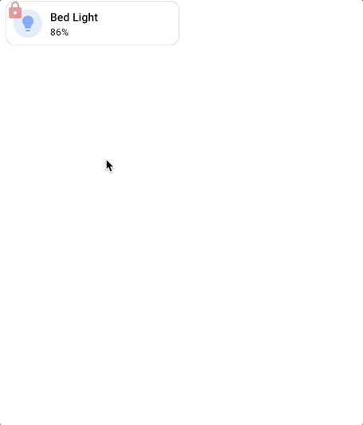
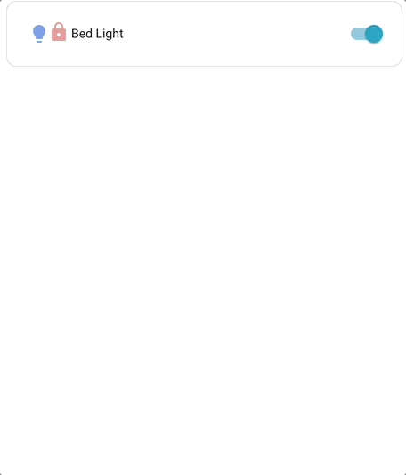
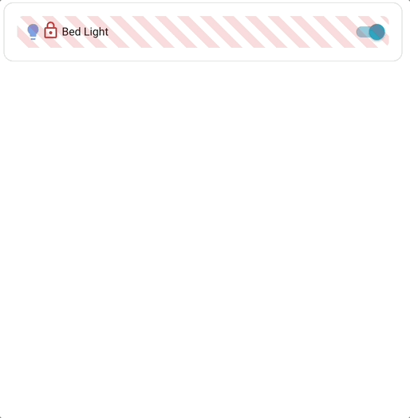

# :material-lock: Lock spark

!!! info
    Lock spark is available in 6.1.0-beta.14

The `lock` spark overlays a lock icon on any element inside a [UIX Forge](../index.md) forged element. While locked, all pointer interactions with the underlying element are blocked. The user unlocks it via a tap, hold, or double-tap, which can require a PIN code, a text passphrase, or a simple confirmation. After a configurable `duration` the overlay automatically re-locks.

All dialogs for code/passphrase input, confirmation and feedback use native Home Assistant dialogs.

---

!!! tip
    All the full examples add `admins: true` to the lock config being used, as you will be an admin when testing. Otherwise it will look like the lock is not working.

## Basic usage

!!! example inline end "Basic usage"
    

Basic examples includes admins in lock config considering that admins will be implementing lock spark. Remove `admins: true` if lock will be bypassed for admins.

```yaml
type: custom:uix-forge
forge:
  mold: card
  sparks:
    - type: lock
      locks:
        - code: 1234
          admins: true
element:
  type: tile
  entity: light.bed_light
```

---

## Targeting specific elements with `for`

!!! example inline end "Targeting example"
    

Like other sparks, `for` accepts the same [DOM navigation syntax](../../concepts/dom.md) as UIX styles, including `$` to cross shadow-root boundaries.

Here an entities row is the target for the lock. `action` is hold.

```yaml
type: entities
entities:
  - type: custom:uix-forge
    forge:
      mold: row
      sparks:
        - type: lock
          for: $ hui-generic-entity-row
          action: hold
          locks:
            - code: 1234
              admins: true
    element:
      entity: light.bed_light
```

!!! warning
    As rows in entities card are displayed inline (`display: inline`) deeper element targeting cannot take place as overlays do not work with elements which are displayed inline. This means that lock spark can only apply to an entire entity row.

---

## Lock-matching logic

`locks` is an ordered list. The **first matching entry** determines what the current user must do to unlock. An entry matches according to these rules:

| Configuration | Who it matches |
|---|---|
| `users` list present | Users whose name is in the list. If `admins: true`, also admins. |
| No `users` list | All non-admin users not in the `except` list. |
| No `users` list + `admins: true` | **All users** (admin and non-admin) not in the `except` list. |

`admins` is an **additive** flag. On a no-`users`-list entry it *extends* the default scope (all non-admins) to also include admins, making the entry match everyone. Admins are **excluded by default** from every entry that does not explicitly set `admins: true` or list them in `users`.

When an entry has `active: false`, matched users are **not locked** (the overlay is hidden for them).  
When no entry matches:

- `permissive: true` → element is accessible for everyone (no overlay shown).
- `permissive: false` (default) → **admins auto-bypass** (no overlay); non-admins are permanently blocked with no unlock path.

---

## Configuration reference

### Top-level keys

| Key | Type | Default | Description |
|---|---|---|---|
| `type` | string | — | Must be `lock`. |
| `for` | string | `element` | UIX selector for the element to overlay. Default targets the root of the forged element. |
| `action` | string | `tap` | Gesture that triggers the unlock flow. One of `tap`, `hold`, `double_tap`. |
| `duration` | number or string | `3000` | How long before the overlay re-locks after a successful unlock. Numbers are milliseconds; strings use human-readable units (e.g. `"5s"`, `"1m"`, `"500ms"`). |
| `icon_locked` | string | `mdi:lock-outline` | MDI icon shown when locked. |
| `icon_unlocked` | string | — | MDI icon shown when unlocked. When not set, the lock icon fades out instead of being replaced. |
| `icon_locked_color` | string | `--error-color` | CSS color for the locked icon. |
| `icon_unlocked_color` | string | `--success-color` | CSS color for the unlocked icon (only used when `icon_unlocked` is set). |
| `icon_position` | object | when forge mold is row default is `{top: 6, left: 30}` | Pixel offsets for the icon inside the overlay. Accepts any combination of `top`, `bottom` (exclusive pair) and `left`, `right` (exclusive pair). Numbers are treated as pixels; strings accept any CSS value. |
| `permissive` | boolean | `false` | When `true`, elements are accessible if no lock entry matches the current user. |
| `entity` | string | — | Entity ID used when `unlocked_action` is a plain HA action. |
| `unlocked_action` | object | — | Action to execute immediately after a successful unlock. |
| `locks` | list | `[]` | Ordered list of lock entries (see below). |
| `code_dialog` | object | — | Options forwarded to the code/passphrase dialog (see below). |

### `code_dialog`

Controls the appearance of the PIN / passphrase entry dialog shown when a lock entry requires a code.

| Key | Type | Default | Description |
|---|---|---|---|
| `title` | string | HA default | Dialog title. When omitted Home Assistant's built-in default title is used. |
| `confirm_text` | string | HA default | Label for the confirm/submit button. When omitted Home Assistant's built-in default label is used. |
| `cancel_text` | string | HA default | Label for the cancel button. When omitted Home Assistant's built-in default label is used. |

### `unlocked_action`

| Value | Effect |
|---|---|
| `action: element_tap` | Fires the forged element's `tap_action`. |
| `action: element_hold` | Fires the forged element's `hold_action`. |
| `action: element_double_tap` | Fires the forged element's `double_tap_action`. |
| Any HA action object | Dispatches that action against `entity` (e.g. `action: toggle`). |

### Lock entry keys

| Key | Type | Default | Description |
|---|---|---|---|
| `active` | boolean | `true` | Set to `false` to explicitly unlock for matched users (no overlay). |
| `code` | string or number | — | Code to enter. Numeric values display the HA numpad; text values display a password field. |
| `pin` | string or number | — | Alias for `code`. |
| `confirmation` | string or boolean | — | Confirmation prompt. Pass `true` for HA's default localised text, or a custom string. |
| `users` | list of strings | — | Usernames this entry applies to. |
| `admins` | boolean | `false` | **Additive flag.** On a no-`users`-list entry, setting `admins: true` extends the entry to cover **all users** (admin and non-admin). On a `users`-list entry, it additionally covers admins. Admins are excluded from every entry where this is `false` or unset. |
| `except` | list of strings | — | Users exempt from this entry (only used when no `users` list). |
| `retry_delay` | number or string | — | How long to wait between code attempts after a wrong entry. Numbers are milliseconds; strings use human-readable units (e.g. `"10s"`). |
| `max_retries` | number | — | Maximum consecutive wrong attempts before the extended delay kicks in. |
| `max_retries_delay` | number or string | `30000` | How long to lock out after `max_retries` wrong attempts. Numbers are milliseconds; strings use human-readable units (e.g. `"30s"`, `"5m"`). |

---

## Examples

### Same PIN for everyone (including admins)

`admins: true` extends the entry to cover everyone — a single entry is sufficient:

```yaml
locks:
  - code: 1234
    admins: true   # applies to all users (non-admins by default + admins because admins: true)
```

### No lock for admins (default) and a specific user

Admins bypass any entry that does not have `admins: true` or list them in `users`. Here
user1 is explicitly unlocked, and all other non-admin users must enter a PIN:

```yaml
locks:
  - active: false
    users:
      - user1
  - code: 1234      # non-admins only (admins are excluded by default)
```

### Confirmation for everyone including admins

```yaml
locks:
  - admins: true
    confirmation: true
```

### PIN for everyone, no lock for named users

```yaml
permissive: false
locks:
  - active: false
    users:
      - trusted_user
  - code: 1234
    admins: true   # apply to everyone (including admins)
```

### Different PINs per user group, admins bypass

Because `admins: true` on a no-`users`-list entry matches *everyone*, you cannot create an
admin-specific entry using that approach alone. To give admins their own PIN, list them
explicitly in the `users` key:

```yaml
locks:
  - users:
      - admin_user
    code: 9876     # admin_user gets this PIN
  - users:
      - jim
      - alison
    code: 1234
  - users:
      - john
      - jane
    code: 4567
```

### Locked for specific users only (`permissive: true`)

```yaml
permissive: true
locks:
  - users:
      - jim
      - alison
    code: 1234
```

### Tile card: execute hold_action on unlock

```yaml
type: custom:uix-forge
forge:
  mold: card
  sparks:
    - type: lock
      unlocked_action:
        action: element_hold
      locks:
        - code: 1234
          admins: true
element:
  type: tile
  entity: light.bed_light
  hold_action:
    action: toggle
```

### Tile card: toggle entity directly on unlock

```yaml
type: custom:uix-forge
forge:
  mold: card
  sparks:
    - type: lock
      entity: light.bed_light
      unlocked_action:
        action: toggle
      locks:
        - code: 1234
          admins: true
element:
  type: tile
  entity: light.bed_light
```

---

### Custom code dialog labels

Use `code_dialog` to override the title and button labels shown in the PIN / passphrase entry dialog:

```yaml
type: custom:uix-forge
forge:
  mold: card
  sparks:
    - type: lock
      code_dialog:
        title: 'Enter Pin:'
        confirm_text: 'Unlock'
        cancel_text: 'Cancel'
      locks:
        - code: 1234
          admins: true
element:
  type: tile
  entity: light.bed_light
```

---

## Customizing the overlay appearance

The lock overlay respects a set of CSS custom properties. Set these on the forged element's `uix.style` (or in a theme) to customise the look:

| CSS variable | Default | Description |
|---|---|---|
| `--uix-lock-z-index` | `10` | Stack order of the overlay. |
| `--uix-lock-display` | `block` | CSS display of the lock overlay. Adjust for any positioning workarounds required with target element scenarios. |
| `--uix-lock-opacity` | `0.5` | Opacity of the overlay (icon and background combined). |
| `--uix-lock-background` | `transparent` | Background colour of the overlay when locked. |
| `--uix-lock-background-unlocked` | `none` | Background colour of the overlay when unlocked. Defaults to no background so `--uix-lock-background` does not bleed into the unlocked state. |
| `--uix-lock-background-blocked` | `--uix-lock-background` | Background colour when the lock is permanently blocked (no unlock path, non-row molds). |
| `--uix-lock-border-radius` | `inherit` | Border radius of the overlay (inherits the target's). |
| `--uix-lock-icon-size` | `24px` | Size of the lock icon. |
| `--uix-lock-icon-position` | `none` | CSS `translate` value applied to the icon (e.g. `30px 6px`). Useful for CSS-only positioning when `icon_position` is not set in config. |
| `--uix-lock-icon-fade-duration` | `2s` | Duration of the opacity fade when the lock icon fades away on unlock (only used when `icon_unlocked` is not set). |
| `--uix-lock-row-background` | `--uix-lock-background` | Background colour of the overlay when the forge mold is `row`. |
| `--uix-lock-row-border-radius` | `--uix-lock-border-radius` | Border radius of the overlay when the forge mold is `row`. |
| `--uix-lock-row-outlined-blocked` | `none` | CSS `outline` value applied to the overlay in row mold when the lock is permanently blocked. |

### Styling example

Using UIX Styling to apply a locked background, unlocked background and reduced opacity. A locked icon is also used in this example.

!!! example inline end "Styling example"
    

```yaml
type: entities
entities:
  - type: custom:uix-forge
    forge:
      mold: row
      sparks:
        - type: lock
          for: $ hui-generic-entity-row
          duration: 5s
          icon_unlocked: mdi:lock-open-variant-outline
          permissive: true
          locks:
            - code: 1234
              admins: true
      uix:
        style: |
          :host {
            --uix-lock-background: url("data:image/svg+xml,%3Csvg xmlns='http://www.w3.org/2000/svg' width='32' height='32' viewBox='0 0 24 24'%3E%3Cpath fill='red' fill-opacity='.18' d='M18 8h-1V6c0-2.76-2.24-5-5-5S7 3.24 7 6v2H6c-1.1 0-2 .9-2 2v10c0 1.1.9 2 2 2h12c1.1 0 2-.9 2-2V10c0-1.1-.9-2-2-2zm-6 9c-1.1 0-2-.9-2-2s.9-2 2-2 2 .9 2 2-.9 2-2 2zm3.1-9H8.9V6c0-1.71 1.39-3.1 3.1-3.1 1.71 0 3.1 1.39 3.1 3.1v2z'/%3E%3C/svg%3E") 0 0/20px 20px repeat, rgba(200,0,0,0.08);
            --uix-lock-background-unlocked: url("data:image/svg+xml,%3Csvg xmlns='http://www.w3.org/2000/svg' width='32' height='32' viewBox='0 0 24 24'%3E%3Cpath fill='green' fill-opacity='.08' d='M18 8h-1V6c0-2.76-2.24-5-5-5S7 3.24 7 6v2H6c-1.1 0-2 .9-2 2v10c0 1.1.9 2 2 2h12c1.1 0 2-.9 2-2V10c0-1.1-.9-2-2-2zm-6 9c-1.1 0-2-.9-2-2s.9-2 2-2 2 .9 2 2-.9 2-2 2zm3.1-9H8.9V6c0-1.71 1.39-3.1 3.1-3.1 1.71 0 3.1 1.39 3.1 3.1v2z'/%3E%3C/svg%3E") 0 0/20px 20px repeat, rgba(0,200,0,0.04);
            --uix-lock-opacity: 1;
            --uix-lock-border-radius: 8px;
          }
    element:
      entity: light.bed_light
```

---

## Templates

Like all spark config, `locks` entries are processed as Jinja2 templates, so you can make `active` conditional:

```yaml
- type: lock
  locks:
    - active: "{{ is_state('input_boolean.lock_enabled', 'on') }}"
      code: 1234
      admins: true
```

!!! tip
    Use the [`uix_forge_path()`](../../concepts/dom.md#uix_forge_path0-forge-helper) helper in your browser DevTools console to find the right `for` selector for any element you want to lock.
