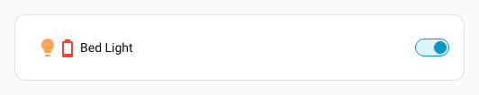
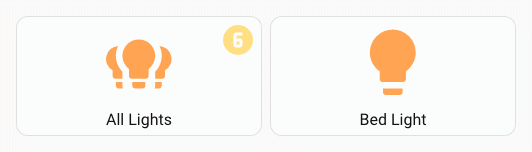
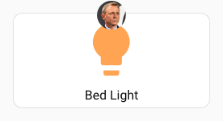

# :material-star-four-points-outline: Overlay Icon spark

!!! note
    Overlay icon spark available in version 7.5.0-beta.1

The `overlay-icon` spark overlays an icon on any element inside a [UIX Forge](../index.md) forged element.

- If `entity` is set, the spark renders a `ha-state-icon`.
- If `image_url` is set, the spark renders a `div` with the image as `background-image`.
- Otherwise it renders a `ha-icon`.

The icon can come from:

- a fixed MDI or custom icon (`icon`)
- an image URL (`image_url`)
- an entity state icon (`entity`)

## Basic usage

```yaml
type: custom:uix-forge
forge:
  mold: card
  sparks:
    - type: overlay-icon
      for: hui-tile-card $ ha-tile-icon
      icon: mdi:shimmer
element:
  type: tile
  entity: light.bed_light
```


## Configuration reference

### Top-level keys

| Key | Type | Default | Description |
|---|---|---|---|
| `type` | string | — | Must be `overlay-icon`. |
| `for` | string | `element` | UIX selector for the element to overlay. Default targets the root of the forged element. |
| `icon` | string | — | MDI/custom to show. Use one of `icon` or `image_url` |
| `image_url` | string | — | Static image applied as overlay. Supports `media-source://` URIs. Use one of `icon` or `image_url`. |
| `entity` | string | — | If provided a state icon is rendered (`ha-state-icon`). When `entity` is set, `icon` and `image_url` are ignored. |
| `value` | string | — | If `entity` is provided you can override the state value used to generate the icon. |
| `state_color` | boolean | `true` | If `entity` is provided whether state color is used for the icon. |
| `icon_color` | string | `var(--white-color)` when target is `ha-tile-icon`, `var(--primary-color)` otherwise | CSS color for the icon. Overrides state color if set. |
| `icon_position` | object | when target is `hui-generic-entity-row`: `{top: '8px', left: '30px'}`; when target is `ha-tile-icon`: `{top: '2px', left: '30px'}`; otherwise not set | Pixel offsets for the icon inside the overlay. Accepts any combination of `top`, `bottom` and `left`, `right`. Numbers are treated as pixels; strings accept any CSS value. |
| `icon_size` | number or string | `12px` when target is `ha-tile-icon`, `24px` otherwise | Size of the icon. Numbers are treated as pixels; strings are passed through as-is. |
| `icon_background` | CSS background | `var(--primary-color)` when target is `ha-tile-icon`, otherwise not set | Explicit CSS background for the icon (overrides the default background-color behavior). |

## Customizing the overlay appearance

The overlay icon respects CSS custom properties. Set these on the forged element's `uix.style` (or in a theme):

| CSS variable | Default | Description |
|---|---|---|
| `--uix-overlay-icon-z-index` | `1` | Stack order of the overlay. |
| `--uix-overlay-icon-display` | `block` | CSS display of the overlay. |
| `--uix-overlay-icon-opacity` | `1` when target is `ha-tile-icon`; `0.5` otherwise | Opacity of the overlay (icon and background combined). |
| `--uix-overlay-icon-border-radius` | `inherit` | Border radius of the overlay (inherits the target's). |
| `--uix-overlay-icon-row-border-radius` | `--uix-overlay-icon-border-radius` | Border radius of the overlay when the forge mold is `row`. |
| `--uix-overlay-icon-border` | `unset` | Border style CSS. |
| `--uix-overlay-icon-size` | `24px`; `12px` when target is `ha-tile-icon` | Size of the icon. Overrides `icon_size` from spark config. |
| `--uix-overlay-icon-color` | `var(--primary-color)`; `var(--white-color)` when target is `ha-tile-icon` | Icon color. |
| `--uix-overlay-icon-background` | `transparent`; `var(--primary-color)` when target is `ha-tile-icon` | Background color of the icon element when `icon_background` is not explicitly set. |
| `--uix-overlay-icon-icon-border-radius` | `none`; `50%` when target is `ha-tile-icon` | Border radius of the icon element. |
| `--uix-overlay-icon-padding` | `0`; `2px` when target is `ha-tile-icon` | Padding around the icon. |
| `--uix-overlay-icon-position` | `none` | CSS `translate` value applied to the icon (e.g. `30px 6px`). |

!!! warning
    As rows in entities card are displayed inline (`display: inline`) deeper element targeting cannot take place as overlays do not work with elements displayed inline. This means overlay-icon spark can only apply to an entire entity row.

!!! note
    Overlay-based sparks set `position: relative` on the targeted element when its computed position is `static`, so the absolute overlay can be anchored correctly.

## Examples

### Tile icon overlay badge

```yaml
type: custom:uix-forge
forge:
  mold: card
  sparks:
    - type: overlay-icon
      for: hui-tile-card $ ha-tile-icon
      icon: mdi:check-decagram
      icon_color: white
      icon_background: "#22b922"
element:
  type: tile
  entity: light.bed_light
```


!!! note
    For non-entity overlays, when multiple icon source keys are set the spark resolves precedence as:
    `image_url` → `icon`.

### Entity-driven overlay icon with value override

```yaml
type: entities
entities:
  - type: custom:uix-forge
    forge:
      mold: row
      sparks:
        - type: overlay-icon
          for: $ hui-generic-entity-row
          entity: sensor.outside_temperature_battery
          state_color: true
          value: "10"
      uix:
        style: |
          :host {
            --uix-overlay-icon-opacity: 1;
          }
    element:
      entity: light.bed_light
```



### Overlay icon on a button showing the number of lights on (max 9)

Uses a macro to translate number of lights on to a circle number icon.

*An extra button is used to change the state of one light for the animated example.*

```yaml
type: custom:uix-forge
forge:
  macros:
    icon:
      params:
        - group_id
      template: |
        
        
        
        {{ icons[iconIndex] }}
  mold: card
  sparks:
    - type: overlay-icon
      icon: |
        {{ icon(config.element.entity) }}
      icon_size: 36px
      icon_color: |
        {{ "var(--state-active-color)" if is_state(config.element.entity, "on")  else "var(--state-inactive-color)" }}
      icon_position:
        left: calc(100% - 36px - 6px)
        top: 6px
element:
  show_name: true
  show_icon: true
  type: button
  entity: light.all_lights
```



### Overlay icon with media source image_url and styling to show as a popover style badge

```yaml
type: custom:uix-forge
forge:
  mold: card
  sparks:
    - type: overlay-icon
      for: hui-button-card $ ha-card $
      icon_size: 36
      image_url: media-source://media_source/local/daniel_craig_cropped.jpg
  uix:
    style: |
      :host {
        --uix-overlay-icon-opacity: 1;
        --uix-overlay-icon-icon-border-radius: 50%;
        --uix-overlay-icon-position: 0px -16px;
      }
element:
  type: button
  entity: light.bed_light
  uix:
    style: |
      ha-card {
        overflow: visible !important;
      }
```

