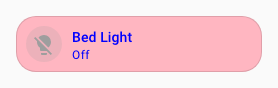

# :material-palette: Theme Spark

The `theme` spark applies a frontend theme to a target element.

Use it when you want a forged element to pick up an existing theme without adding extra UIX styling config.

## Configuration

| Key | Type | Required | Default | Description |
|-----|------|----------|---------|-------------|
| `type` | string | ✅ | — | Must be `theme`. |
| `for` | string | | `element` | UIX selector path for the element to apply the theme to. |
| `theme` | string | | — | Theme name to apply. Supports templates. |

!!! tip
    `theme` config supports templates. To revert the theme back to the main theme, have your template return an empty string `""`. This will apply the main theme to `for`. As themes are applied by setting inline style properties to the element, your override theme should include the same theme elements, or be a subset of elements of the main theme. If you are using theme sparks on a cascade of forged elements, it is best to have each theme override be a subset of the prior theme override, or unexpected results may occur.

## Example

Theme:

```yaml
my-theme:
  primary-text-color: blue
  ha-card-border-radius: 20px
  ha-card-background: lightpink
```

UIX Forge:

```yaml
type: custom:uix-forge
forge:
  mold: card
  sparks:
    - type: theme
      for: element
      theme: my-theme
element:
  type: tile
  entity: light.bed_light
```



!!! tip
    You can use the [`uix_forge_path()`](../../concepts/dom.md#uix_forge_path0-forge-helper) DOM helper to take the guesswork out of finding the right path for `for`.
