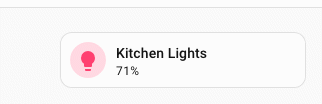
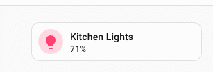
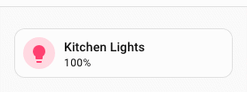

# :speech_balloon: Tooltip spark

The `tooltip` spark attaches a styled tooltip to any element inside a [UIX Forge](../index.md) forged element. It uses Home Assistant's `wa-tooltip` component (the same component used throughout the HA frontend), so it integrates with the HA design system, supports 12 placement positions and floats above all other UI layers via the browser's Popover API.

## Basic usage

Add a `tooltip` entry to `forge.sparks`:

```yaml
type: custom:uix-forge
forge:
  mold: card
  sparks:
    - type: tooltip
      for: hui-tile-card
      content: Turn on the lights
element:
  type: tile
  entity: light.kitchen_lights
```


The `for` value is a selector that locates the target element within the forged element. It supports the same [DOM navigation syntax](../../concepts/dom.md) as UIX styles, including `$` to cross shadow-root boundaries.

```yaml
type: custom:uix-forge
forge:
  mold: card
  sparks:
    - type: tooltip
      for: hui-tile-card $ ha-tile-icon
      content: Toggle the living room light
element:
  type: tile
  entity: light.kitchen_lights
```



Only the **first** element matched by `for` gets the tooltip.

## Configuration

| Key | Type | Required | Default | Description |
| --- | ---- | -------- | ------- | ----------- |
| `type` | `string` | ✅ | — | Must be `tooltip`. |
| `for` | string | | `element` | UIX selector for the target element. Default `element` refers to the root of the forged element. |
| `content` | string | | `""` | HTML content of the tooltip body. |
| `placement` | string | | `"top"` | Tooltip position relative to the target. Placement values are `top`, `top-start`, `top-end`, `bottom`, `bottom-start`, `bottom-end`, `left`, `left-start`, `left-end`, `right` · `right-start`, `right-end`. |
| `distance` | number | | `8` | Gap in pixels between the tooltip and the target element. |
| `skidding` | number | | `0` | Offset in pixels along the target element's axis. |
| `show_delay` | number | | `150` | Milliseconds to wait before showing the tooltip. |
| `hide_delay` | number | | `150` | Milliseconds to wait before hiding the tooltip. |
| `without_arrow` | boolean | | `false` | Set to `true` to hide the directional arrow. |

!!! tip
    You can use the [`uix_forge_path()`](../../concepts/dom.md#uix_forge_path0-forge-helper) DOM helper to take the guesswork out of finding the right path for `for`.

## Templates in content

The `content` value is part of the `forge` config and is therefore processed as a template, giving you access to entity states, the `config` object and any other [UIX template variables](../../using/templates.md):

```yaml
type: custom:uix-forge
forge:
  mold: card
  sparks:
    - type: tooltip
      for: "hui-tile-card $ ha-tile-icon"
      content: >-
        {{ state_attr(config.element.entity, 'friendly_name') }} is
        {{ states(config.element.entity) }}
element:
  type: tile
  entity: light.kitchen_lights
```



## Customising tooltip appearance

The tooltip spark injects CSS variables into the `wa-tooltip` element. Override them by setting `--uix-tooltip-*` variables on the forged element's `uix.style` (or in a theme).

!!! note
    As a tooltip is added as a sibling to the element it is `for`, if you wish to style the tooltip you will need to make sure your styled element is a parent of the `for` element. In the styling example, the styles are applied to `:host` and the tooltip applied to `ha-card` in the hosts shadow root.

```yaml
type: custom:uix-forge
forge:
  mold: card
  sparks:
    - type: tooltip
      for: hui-tile-card $ ha-card
      content: Custom styled tooltip
element:
  type: tile
  entity: light.kitchen_lights
  uix:
    style: |
      :host {
        --uix-tooltip-background-color: #333;
        --uix-tooltip-content-color: #fff;
        --uix-tooltip-border-radius: 999px;
      }
```



### CSS variables reference

| CSS variable | Default | Description |
| ------------ | ------- | ----------- |
| `--uix-tooltip-background-color` | `--secondary-background-color` | Tooltip background colour. |
| `--uix-tooltip-content-color` | `--primary-text-color` | Tooltip text colour. |
| `--uix-tooltip-font-family` | `--ha-font-family-body` | Font family. |
| `--uix-tooltip-font-size` | `--ha-font-size-s` | Font size. |
| `--uix-tooltip-font-weight` | `--ha-font-weight-normal` | Font weight. |
| `--uix-tooltip-line-height` | `--ha-line-height-condensed` | Line height. |
| `--uix-tooltip-padding` | `8px` | Padding inside the tooltip. |
| `--uix-tooltip-border-radius` | `--ha-border-radius-sm` | Border radius. |
| `--uix-tooltip-arrow-size` | `8px` | Size of the directional arrow. |
| `--uix-tooltip-border-width` | — | Border width (unset by default). |
| `--uix-tooltip-border-color` | — | Border colour (unset by default). |
| `--uix-tooltip-border-style` | — | Border style (unset by default). |
| `--uix-tooltip-max-width` | `30ch` | Maximum width of the tooltip. |
| `--uix-tooltip-show-duration` | `100ms` | Duration of the show animation. |
| `--uix-tooltip-hide-duration` | `100ms` | Duration of the hide animation. |
| `--uix-tooltip-opacity` | `1` | Tooltip opacity. |
| `--uix-tooltip-box-shadow` | `--ha-card-box-shadow` | Box shadow. |
| `--uix-tooltip-text-align` | `center` | Text alignment. |
| `--uix-tooltip-text-decoration` | `none` | Text decoration. |
| `--uix-tooltip-text-transform` | `none` | Text transform. |
| `--uix-tooltip-overflow-wrap` | `normal` | Overflow-wrap behaviour. |
