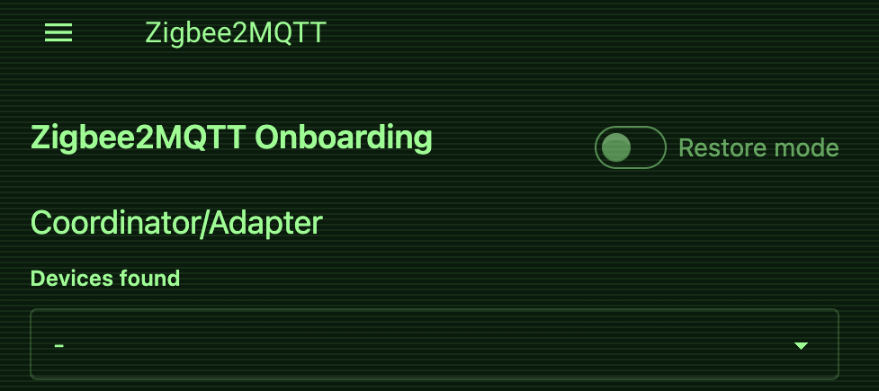

# Styling app and ingress panels

Home Assistant displays an individual app or ingress page in a
`<ha-panel-app>` element. Use the `uix-app` or `uix-app-yaml` theme key to
style that panel's open shadow root.

This is different from the installed-apps list at `/config/apps/installed`,
which belongs to the configuration panel and uses `uix-config`.

## Example

This example styles the panel header and places a non-interactive CRT overlay
above the ingress iframe:

```yaml
My theme:
  uix-theme: My theme

  uix-app: |
    :host {
      position: relative;
    }

    .header {
      background: #041b0b !important;
      color: #7cff88 !important;
    }

    :host::after {
      content: "";
      position: absolute;
      inset: 0;
      z-index: 1;
      pointer-events: none;
      background: repeating-linear-gradient(
        to bottom,
        rgb(124 255 136 / 8%) 0,
        rgb(124 255 136 / 8%) 1px,
        transparent 1px,
        transparent 3px
      );
    }
```

{ width="450px" }

## Scope

`uix-app` continues to style the Home Assistant panel chrome and can overlay its
iframe. UIX also installs its internal frame runtime in same-origin app frames.
Frame-content styling requires the experimental
[Style frame panels](../extras/style-frame-panels.md) option; host styling does
not.
For frame content, use `uix-<add-on-slug>` (or the `-yaml` form). UIX first
checks the complete Home Assistant add-on slug and then a repository-independent
slug with `core_`, `local_`, or an eight-character repository hash removed.
For example, `uix-a0d7b954_nodered` takes precedence over `uix-nodered`.

The frame runtime is an internal API shared with iframe custom panels. This does
not merge the user-facing concepts: `uix-app` always means the `<ha-panel-app>`
container, while `uix-panel-custom` always means the `<ha-panel-custom>`
container.
