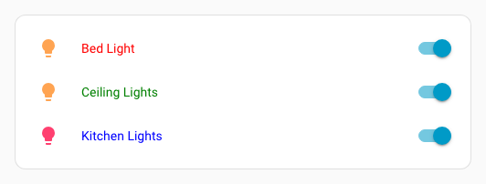
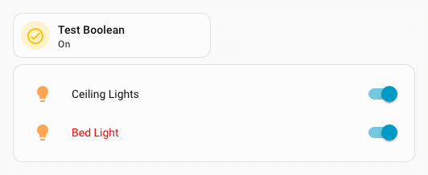
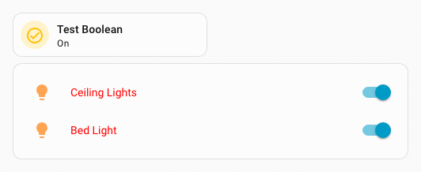
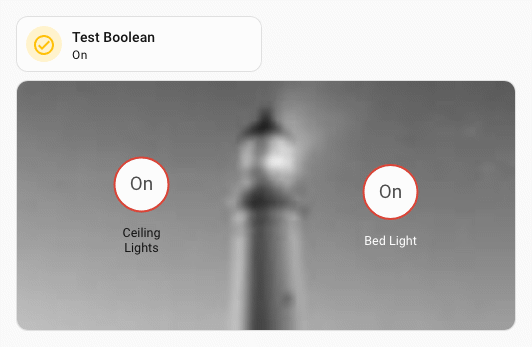
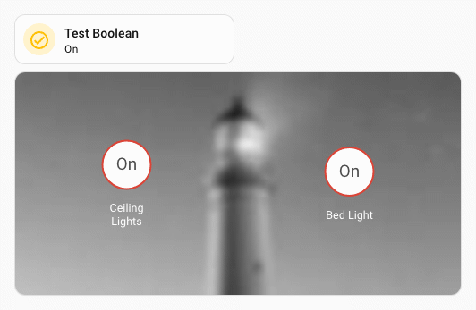
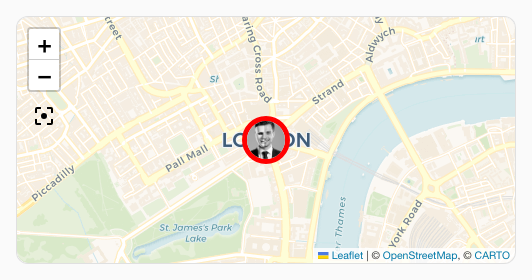

# Styling entities, badges, elements and entity markers

In `entities`, `glance` and `map` cards, [each entity can have options](https://www.home-assistant.io/lovelace/entities/#options-for-entities). Those elements can be styled individually by adding a `uix` parameter to the entity configuration.

For those cases, the styles are injected into a shadowRoot, and the bottommost element is thus accessed through `:host`.

This also applies to view badges and elements in `picture-elements` cards.

```yaml
type: entities
entities:
  - entity: light.bed_light
    uix:
      style: |
        :host {
          color: red;
          }
  - entity: light.ceiling_lights
    uix:
      style: |
        :host {
          color: green;
        }
  - entity: light.kitchen_lights
    uix:
      style: |
        :host {
          color: blue;
        }
```



## Styling entities conditional rows

Rows in entities conditional rows can be styled directly. If you style the conditional config itself, you need to take care as the conditional row wrapper is not in a shadowRoot so styles may leak to other rows/elements.

??? example "Conditional row examples"
    Styling a conditional row directly. Only the entity row.
    ```yaml
    type: entities
    state_color: true
    entities:
      - entity: light.ceiling_lights
      - type: conditional
        conditions:
          - condition: state
            entity: input_boolean.test_boolean
            state: 'on'
        row:
          entity: light.bed_light
          uix:
            style: |
              :host {
                color: red;
              }
    ```
    Styling a conditional row config using shadowRoot. This method is available for legacy configurations.
    ```yaml
    type: entities
    state_color: true
    entities:
      - entity: light.ceiling_lights
      - type: conditional
        conditions:
          - condition: state
            entity: input_boolean.test_boolean
            state: "on"
        row:
          entity: light.bed_light
        uix:
          style:
            hui-toggle-entity-row $ hui-generic-entity-row $: |
              .row {
                color: red;
              }
    ```
    Both the above will give the following output.

    

    Styling a conditional config where styles will 'leak' to all rows.
    ```yaml
    type: entities
    state_color: true
    entities:
      - entity: light.ceiling_lights
      - type: conditional
        conditions:
          - condition: state
            entity: input_boolean.test_boolean
            state: "on"
        row:
          entity: light.bed_light
        uix:
          style: |
            :host {
              --primary-text-color: red;
            }
    ```
    

## Styling picture-elements conditional elements

The elements in a picture-elements conditional element can be styled directly. If you style the conditional config itself, you need to take care as the conditional element wrapper is not in a shadowRoot so styles may leak to other rows/elements.

??? example "Conditional picture-elements example"
    Styling a conditional element directly. Only the element.
    ```yaml
    type: picture-elements
    image:
      media_content_id: https://picsum.photos/id/870/200/100?grayscale&blur=2
    elements:
      - type: state-badge
        entity: light.ceiling_lights
        style:
          left: 25%
          top: 50%
      - type: conditional
        conditions:
          - entity: input_boolean.test_boolean
            state: "on"
        elements:
          - type: state-badge
            entity: light.bed_light
            style:
              left: 75%
              top: 50%
            uix:
              style: |
                :host {
                  color: white;
                }
    ```
    Styling the conditional config. This method is available for legacy configurations.
    ```yaml
    type: picture-elements
    image:
      media_content_id: https://picsum.photos/id/870/200/100?grayscale&blur=2
    elements:
      - type: state-badge
        entity: light.ceiling_lights
        style:
          left: 25%
          top: 50%
      - type: conditional
        conditions:
          - entity: input_boolean.test_boolean
            state: "on"
        elements:
          - type: state-badge
            entity: light.bed_light
            style:
              left: 75%
              top: 50%
        uix:
          style:
            hui-state-badge-element $ ha-state-label-badge $: |
              :host {
                color: white;
              }
    ```
    Both the above will give the following output.

    

    Styling the conditional config where styles will 'leak' to all elements.
    ```yaml
    type: picture-elements
    image:
      media_content_id: https://demo.home-assistant.io/stub_config/t-shirt-promo.png
    elements:
      - type: conditional
        conditions:
          - entity: input_boolean.test_boolean
            state: "on"
        elements:
          - type: state-badge
            entity: sun.sun
            style:
              left: 25%
              top: 25%
        uix:
          style: |
            :host {
              --primary-text-color: purple;
            }
    ```
    


## Styling entity markers on a map

Entity markers on a map can be styled individually by card config or by theme. In both examples the picture image is also styled.

Styling by config.

```yaml
  type: map
  entities:
    - entity: device_tracker.uix_test_person
      uix:
        style: |
          div.marker {
            border-color: red !important;
            border-width: 5px;
          }
  theme_mode: auto
```

Styling by theme. Here the `&` host selector is used to take advantage of the `ha-entity-marker` having the `entity-id` as an attribute.

```yaml
  uix-entity-marker-yaml: |
    "&[entity-id='device_tracker.uix_test_person']": |
      :host {
        --uix-image: /local/media/person_grey.png
      }
      div.marker {
        border-color: red !important;
        border-width: 5px;
      }
```

Both the above will give the following output


