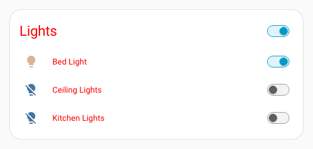
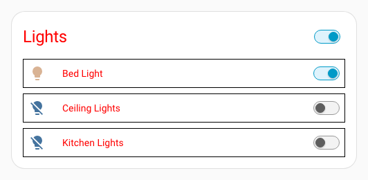
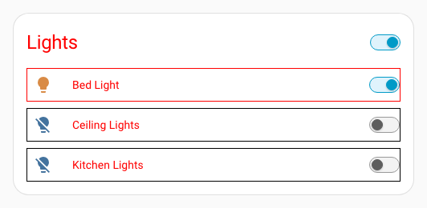
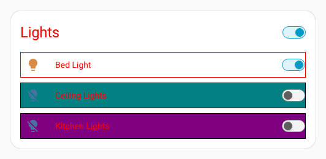

# Themes

## Getting started

To get started, you need themes enabled in Home Assistant.

The best way to do this is to create a new /config/themes/ directory, and then add the following to your configuration.yaml

```yaml
frontend:
  themes: !include_dir_merge_named themes/
```

After restarting Home Assistant, you can place theme files in that directory, load them with the Frontend. [reload_theme](https://www.home-assistant.io/integrations/frontend/#setting-themes) service.

Theme files are normally yaml documents, which contain settings for the many themeable variables available in Home Assistant.

`/config/themes/red.yaml`

```yaml
red-theme:
  primary-color: red
  ha-card-border-radius: 20px
```

!!! tip "Theme name"
    The theme name must be on the first row, and the rest should be indented one level.

{ width="500" }

## Basic UIX theme

!!! info "Theme variable"
    The theme MUST define a variable `uix-theme` which MUST have the same value as the name of the theme. For example:
    ```yaml
    my-awesome-theme:
      uix-theme: my-awesome-theme

      ... other theme variables go here ...
    ```

`/config/themes/red.yaml`

```yaml
red-theme:
  uix-theme: red-theme # this variable must match the theme name including case

  primary-color: red
  primary-text-color: white
  ha-card-border-radius: 20
```

Once `uix-theme` is set, we're ready to do some really powerful things.

To apply the basic functionality of UIX globally, you can use the `uix-<thing>` variables, where `<thing>` is any [theme variable](#theme-variables).

For example, say you want a border around every row in an entities card, you may do something like the following.

```yaml
type: entities
entities:
  - entity: light.bed_light
    style: |
      :host {
        display: block;
        border: 1px solid black;
      }
  - entity: light.ceiling_lights
    uix:
      style: |
        :host {
          display: block;
          border: 1px solid black;
        }
  - entity: light.kitchen_lights
    uix:
      style: |
        :host {
          display: block;
          border: 1px solid black;
        }
```

This can now be added to our theme instead.

```yaml
red-theme:
  uix-theme: red-theme
  ...
  uix-row: |
    :host {
      display: block;
      border: 1px solid black;
    }
```

{ width="500" }

!!! tip "`uix-<thing>` variables"
    `uix-<thing>` variables contain strings containing CSS code, and must start with `|` or `>` and be indented at least one step.

Just like normal, you can use Jinja2 templating to process the styles.

```yaml
red-theme:
  uix-theme: red-theme
  ...
  uix-row: |
    :host {
      display: block;
      border: 1px solid  red  black ;
    }
```

{ width="500" }

## Classes

UIX lets you set a CSS class to elements. You can then use this in your theme.

```yaml
red-theme:
  uix-theme: red-theme
  ...
  uix-row: |
    ...
    :host(.teal) {
      background: teal;
    }
    :host(.purple) {
      background: purple;
    }
```

```yaml
type: entities
entities:
  - entity: light.bed_light
  - entity: light.ceiling_lights
    uix:
      class: teal
  - entity: light.kitchen_lights
    uix:
      class: purple
```

{ width="500" }

## Navigating the shadow DOM

Just like with UIX styles applied to a card, you can traverse the shadow DOM structure of the thing you want to style. To do this, you need to specify the variable `uix-<thing>-yaml`, and then the syntax is exactly the same.

```yaml
red-theme:
  uix-theme: red-theme
  ...
  uix-row: |
    ...
    hui-generic-entity-row $ state-badge $: |
      @keyframes pulse {
        50% {
          opacity: 0.5;
        }
      }
      ha-state-icon {
        animation: pulse 2s infinite;
      }
```

!!! tip "Theme variables MUST be strings"
    While the value of the `uix-<thing>-yaml` variable is actually yaml, as far as the theme is concerned it MUST be a string, which in turn contains more strings.

## Updating `uix-<thing>` variable to `uix-<thing>-yaml` variable

!!! tip "UIX theme variable precedence"
    `uix-<thing>-yaml` always takes precedence over `uix-<thing>` which is NOT used if `uix-<thing>-yaml` is present in the theme.

As you develop your UIX themes you are likely to come to a point where you started with straight CSS strings with `uix-<thing>` but need to update to use `uix-<thing>-yaml`. You can do this by using the root yaml selector `.:`. Below is the full example of the red theme using `uix-row-yaml`.

```yaml
red-theme:
  uix-theme: red-theme # this variable must match the theme name including case

  primary-color: red
  ha-card-border-radius: 20px

  uix-row-yaml: |
    .: |
      :host {
        display: block;
        border: 1px solid  red  black ;
      }
      :host(.teal) {
        background: teal;
      }
      :host(.purple) {
        background: purple;
      }
    hui-generic-entity-row $ state-badge $: |
      @keyframes pulse {
        50% {
          opacity: 0.5;
        }
      }
      ha-state-icon {
        animation: pulse 2s infinite;
      }
```

## Theme variables

- `uix-card`
- `uix-row`
- `uix-glance`
- `uix-badge`
- `uix-heading-badge`
- `uix-assist-chip`
- `uix-element`
- `uix-root`
- `uix-view`
- `uix-more-info`
- `uix-sidebar`
- `uix-config`
- `uix-panel-custom`
- `uix-top-app-bar-fixed`
- `uix-dialog`
- `uix-developer-tools`
- `uix-grid-section`

Also `<any variable>-yaml`.

## Dialogs

`<uix-dialog(-yaml)` applies to styles rooted in the dialog element of dialogs which may be `ha-dialog`, `ha-adaptive-dialog`, `ha-toast` or `ha-drawer` (notification uses dialog with element thing drawer). Dialogs will also have their class set to `type-<dialog-type>` where `<dialog-type>` will be the dialog element name with any `ha-` prefix stripped. e.g. UIX will append `type-dialog-box` to dialog boxes as used by alerts and other dialogs boxes. The Home Assistant dialog manager places dialogs in the shadow root of the top `<home-assistant>` element. The active dialog will be the last child of the shadow root. To view what dialog you wish to target, review the last child of this shadow root node.

See UIX guide [Styling dialogs with UI eXtension](https://uix-guides.lf.technology/dialogs/2026/02/27/styling-dialogs.html).

## Macros

Themes can define reusable Jinja2 macros available to all cards that use the theme. Macros are specified under the `uix-macros-yaml` theme key as a YAML dictionary of macro definitions — see [Templates - Macros](templates.md#macros) for the full macro configuration reference.

    ```yaml
    my-awesome-theme:
      uix-theme: my-awesome-theme

      uix-macros-yaml: |
        is_on:
          params:
            - entity_id
          returns: true
          template: ""
        badge_color:
          params:
            - entity_id
            - name: color_on
              default: "'yellow'"
            - name: color_off
              default: "'gray'"
          template: "{{ color_on if is_state(entity_id, 'on') else color_off }}"
    ```

Card-level `uix.macros` take precedence over theme macros of the same name.
